# Lab 3.1 - Configure the CI/CD pipeline up to production

**Level**: 3 Release Manager

**Time**: ~50 min

**You will**: turn a two-stage pipeline into a four-stage one that reaches production, give the two
new stages their org and a credential a real project can live with, and publish all of it the way
every change reaches a major branch: through a Pull Request.

## The situation

Open the **DevOps Pipeline** panel and look at what Victor left.

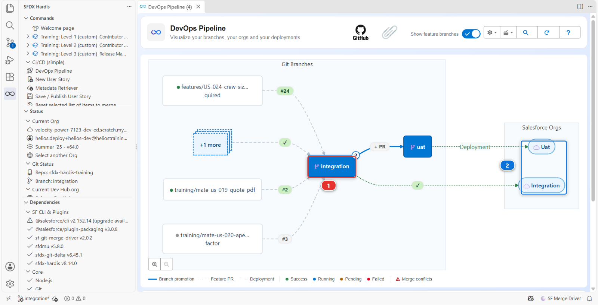

`integration` **(1)** and `uat`, each with its org **(2)**, and the feature branches your teammates
have in flight. Work reaches the business testers, and then it stops. There is no `preprod`, and
`main`, production, is a branch nothing deploys: every release so far reached production by hand,
which is exactly the kind of release nobody can say anything about afterwards.

And the two stages that do exist reach their orgs through a shortcut. The CI logs into
`helios-integration` and `helios-uat` with `SFDX_AUTH_URL_INTEGRATION` and `SFDX_AUTH_URL_UAT`, two
secrets holding long-lived OAuth refresh tokens. Level 1 told you they were an exception for
throwaway scratch orgs. Three things are wrong with them on a real project:

1. **They cannot be rotated.** Changing one means authenticating again, as a human, in a browser
2. **They are bearer credentials with no scope.** Whoever reads the secret has everything that user
   has, from anywhere, until it is revoked
3. **They are tied to a person.** When that person leaves or their token is reset, the pipeline
   stops, and nobody knows why

The alternative is a **JWT flow through an External Client App**: a certificate you hold, a
pre-authorised user, no password anywhere, and revocation by deleting one app. sfdx-hardis sets it
up for you, org by org, and writes the branch configuration while it is at it.

!!! note "Two orgs here, every org on a real project"
    On a real project, every connection the CI makes is a JWT one, `integration` and `uat`
    included. This lab sets it up for two orgs, `helios-preprod` and `helios-prod`, because two
    teach everything four would. `integration` and `uat` keep their Level 1 shortcut, which saves
    you an hour of doing the same thing twice more.

That is your first week. None of it is unusual: most projects start with the stages they need on day
one, and finishing the pipeline waits until the day somebody needs to release properly.

## Before you start

- [ ] Levels 1 and 2 finished
- [ ] `helios-prod` still connected in **Orgs Manager**. It is the Developer Edition org you signed
      up for in Level 1, and the Dev Hub of your scratch orgs. From this lab on, it is also
      production
- [ ] One more free Developer Edition org, signed up at
      [developer.salesforce.com/signup](https://developer.salesforce.com/signup) exactly like the
      first one, and connected in **Orgs Manager** with the alias `helios-preprod`
- [ ] Both seeded: Welcome page > **Training: Level 3** > **Set up one of my training orgs**, once
      for `helios-preprod` and once for `helios-prod`
- [ ] `SFDX_AUTH_URL_INTEGRATION` and `SFDX_AUTH_URL_UAT` still in your fork, as since Level 1: this
      lab leaves them alone
- [ ] On `integration` in VS Code, with nothing waiting in the **Source Control** panel

!!! note "The CI, not your workstation"
    Your own connection to these orgs already exists and is not changing: Orgs Manager keeps
    working exactly as before. What you set up here is how a **GitHub runner**, which is not you and
    has no browser, reaches each org.

## Steps

### 1. Decide the shape

Four questions, and their answers are the whole pipeline:

| Question                                                                     | Helios answer                                                                            |
|------------------------------------------------------------------------------|------------------------------------------------------------------------------------------|
| Which branches are **major**, meaning they have an org and a deployment job? | `integration`, `uat`, `preprod`, `main`                                                  |
| Which branch can merge into which?                                           | `integration` into `uat`, `uat` into `preprod`, `preprod` into `main`. Nothing skips one |
| Which branch is production?                                                  | `main`                                                                                   |
| Where does an urgent fix start?                                              | From `preprod`, so it never carries the work still waiting in `integration` and `uat`    |

If you cannot state them in one sentence each, configuring them will not help.

`preprod` earns its place in two ways. It is the last rehearsal before production, an org that holds
what production holds and that nobody works in, so a release that deploys there cleanly has very few
surprises left. And it is where hotfixes start, which [Lab 3.7](3-7-hotfix-and-retrofit.md) is about.

The order of this lab follows from one rule: **a branch has to exist before an org can be attached
to it**. So the branches come first, then their protection, then their orgs.

### 2. Create the preprod branch

`main` already exists: it is the default branch of every fork. `preprod` does not, and it starts
from `main`, because it holds what production holds.

In your fork (your own copy of the course repository on GitHub, for example
`github.com/my-username/sfdx-hardis-training`), open the **Branches** page: the branch count next to
the branch selector, or `github.com/my-username/sfdx-hardis-training/branches`. Click **New branch**
at the top right. Type `preprod` as the name **(1)**, leave the source on your fork and `main`
**(2)**, and click **Create new branch** **(3)**.

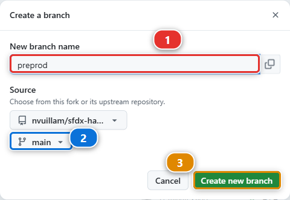

Then tell VS Code: in the **Source Control** panel, **...** menu, **Pull, Push** > **Fetch**. The
next steps list the branches of your fork, and a branch VS Code has not fetched is not in the list.

### 3. Protect preprod and main

From now on, **nobody pushes to a major branch**: not a contributor, not you. Every change reaches
`integration`, `uat`, `preprod` and `main` through a Pull Request whose checks are green, and GitHub
enforces it rather than trusting everybody to remember. Since [Lab 1.2](../level-1-contributor-basics/1-2-create-your-dev-hub-scratch-orgs-and-pipeline.md), `integration` and `uat`
work that way: setting up the environment protected them. `preprod` and `main` are yours to
protect, and a release manager does it the day the branches join the pipeline, not after the first
bad merge.

In your fork (`github.com/my-username/sfdx-hardis-training`), click **Settings** **(1)**, then
**Branches** **(2)** in the left menu. The two rules **(4)** are the ones setting up your environment
created in [Lab 1.2](../level-1-contributor-basics/1-2-create-your-dev-hub-scratch-orgs-and-pipeline.md). Click **Add rule** **(3)**.

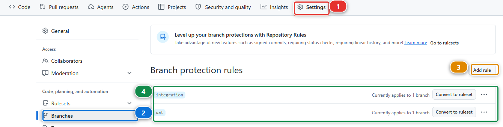

The form is long, and five things on it matter. The picture is the `integration` rule, opened from
the list above, so it shows the values you are about to set:

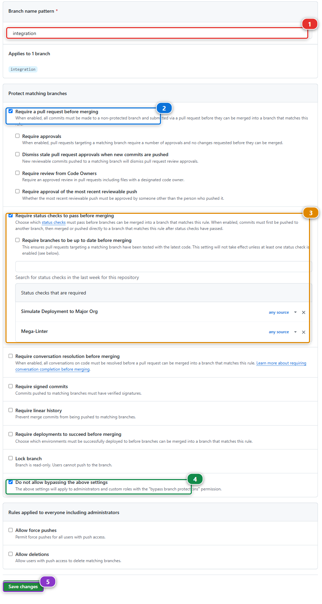

1. **Branch name pattern** **(1)**: `preprod`
2. Tick **Require a pull request before merging** **(2)**, and untick **Require approvals** under
   it: you work alone here, and GitHub never lets you approve your own Pull Request. On a real
   project, ask for one approval
3. Tick **Require status checks to pass before merging** **(3)**. A search box appears under it.
   Type `Simulate` and pick **Simulate Deployment to Major Org**, then type `Mega` and pick
   **Mega-Linter**. Both land in **Status checks that are required**: they are the two checks every
   Pull Request of this course runs
4. Tick **Do not allow bypassing the above settings** **(4)**. Without it, the owner of the
   repository, you, still gets a checkbox to push or merge anyway
5. Click **Create** at the bottom. On an existing rule the same button reads **Save changes**
   **(5)**

Then **Add rule** again, for `main`, with the same settings. Back on the list: four rules,
`integration`, `uat`, `preprod` and `main`.

The search box only suggests checks that ran on this repository in the last seven days. Both ran on
your Level 2 Pull Requests, so they are there unless you took a long break: in that case open any
Pull Request into `integration` first, and its checks put them back in the list.

Under the hood: what the rule enforces

A required check is matched by **its job name**, not by the workflow file. `Simulate Deployment to
Major Org` is the job of `.github/workflows/check-deploy.yml`, which runs on every Pull Request into
the four major branches. `Mega-Linter` is the job of `.github/workflows/megalinter.yml`, which runs
on every push, so on the last commit of every Pull Request opened from a branch of your fork.

A workflow that only runs when some files change, like `link-check.yml` here, must never be
required: a Pull Request that does not touch those files waits for it forever, and GitHub shows it
as **Expected**, never as failed.

The same rule, set through the GitHub API, is what **Set up my training environment** did for
`integration` and `uat`:

    gh api -X PUT repos/<your-handle>/sfdx-hardis-training/branches/preprod/protection \
      -F "required_pull_request_reviews[required_approving_review_count]=0" \
      -f "required_status_checks[contexts][]=Simulate Deployment to Major Org" \
      -f "required_status_checks[contexts][]=Mega-Linter" \
      -F "required_status_checks[strict]=false" -F enforce_admins=true -F restrictions=null

`strict=false` is a choice: `true` would also require every Pull Request to be up to date with its
target before merging, which on a busy `integration` means updating every open branch after every
merge. GitLab, Azure DevOps and Bitbucket have the same settings under other names: protected
branches, branch policies, merge checks.

### 4. Start a User Story for the configuration

Every file this lab writes ends up on `integration`, and `integration` takes nothing but Pull
Requests: the protection you just looked at is what refuses the rest. So before writing a single
file, get onto a branch of your own. The configuration is a change like any other, it travels up
the pipeline with the rest of the work, and it gets a User Story like any other.

In the **DevOps Pipeline** panel, under **Project Contribution Workflow** **(1)**, click
**New User Story** **(2)**, as in [Lab 1.3](../level-1-contributor-basics/1-3-start-a-user-story-on-a-git-branch.md).

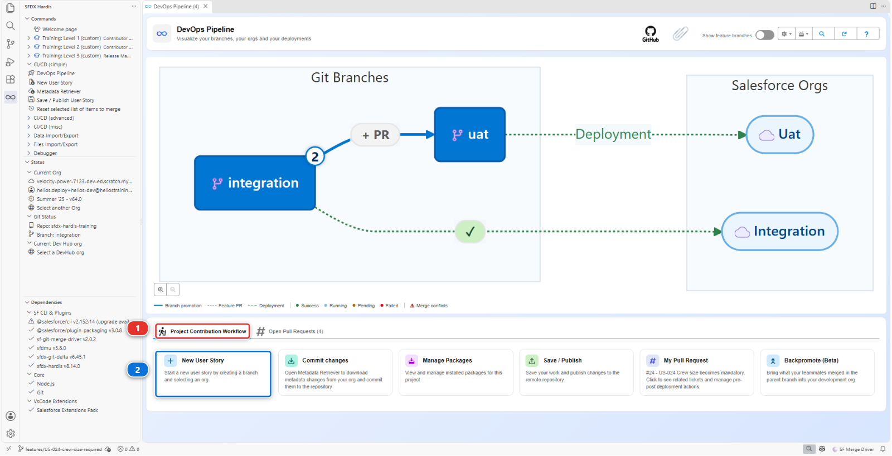

1. The first line reads **Automatically selected target branch is integration**. Right: `preprod`
   only joins that list in step 9
2. **What type of User Story do you want to create?** - **Feature: a new capability or an
   improvement**
3. **What is the name of your new User Story?** - `US-050-pipeline-up-to-production`. The course
   checks User Story names against the `US-nnn` pattern, and US-050 is the backlog story for this
   work
4. **Which Salesforce org do you want to work in?** - the last answer, **🤠 I'm hardcore, I don't
   need an org !**, the one with no org at all. Nothing in this lab is built in an org: you edit the
   project's files, and the commands write into the orgs themselves

The command creates `features/US-050-pipeline-up-to-production` from `integration` and checks it
out. Everything the next steps write lands there.

### 5. Configure preprod and its org: Add/Configure Org

Now the orgs. One command does it all for a branch: it writes the branch configuration, the org it
deploys to and the branch it merges into, creates the credential the CI logs in with, and deploys the
External Client App into the org. You run it once per branch, starting with `preprod`.

In the **DevOps Pipeline** panel, click the gear **(1)** at the top right and choose
**Add/Configure Org** **(2)**.

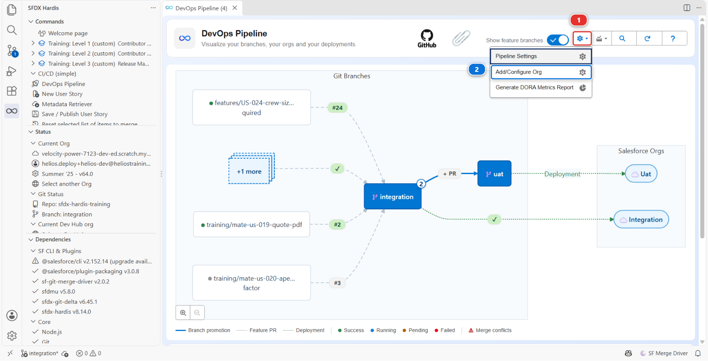

The command runs in a panel and asks one question at a time **(1)**, with the answers to click below
it **(2)**. Here it is at the second question, with `helios-preprod` already chosen.

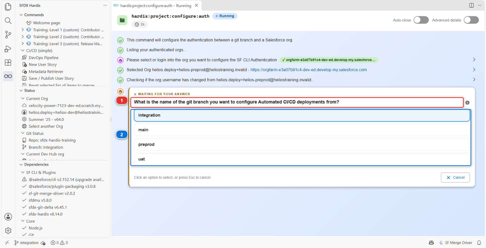

It asks a dozen questions, in this order:

1. **Please select or login into the org you want to configure the SF CLI Authentication** -
   `helios-preprod`. The command makes it your default org. If it asks for the org a second time,
   pick `helios-preprod` again
2. **What is the name of the git branch you want to configure Automated CI/CD deployments from?** -
   `preprod`. The list is built from the branches of your fork, and branches whose name contains
   a `/` are left out, which is why your User Story branch is not offered
3. **What is the base URL or domain or the org you want to connect to, as preprod related
   org ?** Pick **☢️ Other: Dev org, Production org or DevHub org (login.salesforce.com)**:
   `helios-preprod` is a Developer Edition org, which logs in the way production does. Only scratch
   orgs and sandboxes use `test.salesforce.com`. Read the list rather than pressing Enter
4. **What are the target git branches that preprod will be able to merge in?** - `main`. This is
   the merge path of step 1, written as `mergeTargets`
5. **What is the Salesforce username that will be used for deployments by CI server ?** - the
   `helios-preprod` username, which it offers you already filled in
6. **How do you want to provide the SSL certificate?** - **Generate a self-signed certificate
   (default)**. The other answer, CA-signed, generates nothing and only prints instructions
7. **Do you want sfdx-hardis to configure the SF CLI External Client App or Connected App on your
   org ?** - yes
8. **Which JWT certificate storage mode do you want?** - **ClientId + decryption key as secret
   variables + encrypted certificate as file (default)**. The other mode puts the certificate itself
   in a third secret and deletes the file
9. **Please confirm when variables have been set.** This one is a stop, and step 6 is what it is
   waiting for. Do not click **Validate** yet
10. Then, after you confirm: the **name** of the External Client App, a **contact email**, and the
    **profile to pre-authorise**. Take **System Administrator**: it is already selected, so keep it.
    The list shows the profile names in the language of the org's user, so an org set to French
    lists `Administrateur système` instead

### 6. Store the two secrets, then let the command finish

Just above question 9 the panel prints the two values the CI needs **(2)**, each with a copy button.
Nothing prints them again, so do not close the panel. The panel keeps every question you answered
**(1)**, and the files it wrote are in the reports bar at the bottom **(3)**.

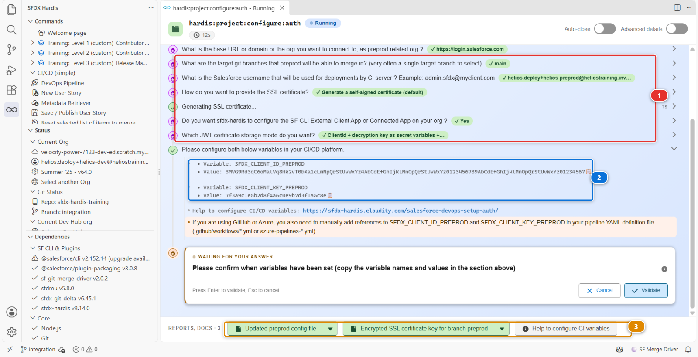

In your fork (`github.com/my-username/sfdx-hardis-training`), open **Settings > Secrets and
variables > Actions (1)**, then click **New repository secret (2)**:

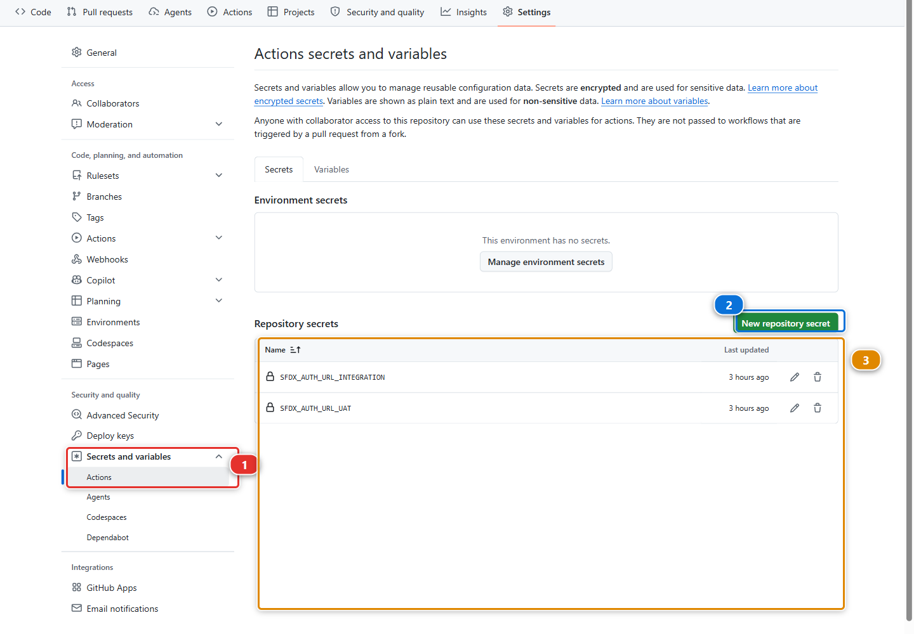

The page lists the **names** of the secrets the repository holds and never their values **(3)**.
Nothing, not even GitHub, can show you a stored value again. That is the whole reason the panel asks
you not to close it.

| Name                      | Value                                |
|---------------------------|--------------------------------------|
| `SFDX_CLIENT_ID_PREPROD`  | the consumer key the command printed |
| `SFDX_CLIENT_KEY_PREPROD` | the passphrase the command printed   |

Each secret is one form: the **Name (1)**, the **Secret (2)** pasted from the panel, then **Add
secret (3)**. The first one is `SFDX_CLIENT_ID_PREPROD`, with the consumer key:

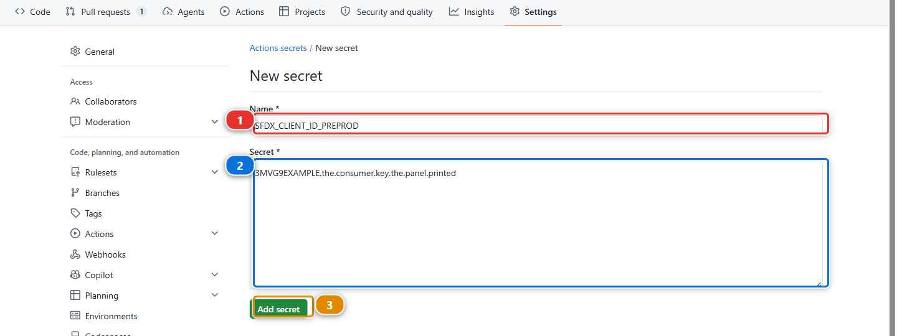

Then the second one. Click **New repository secret** again, and fill the same form with
`SFDX_CLIENT_KEY_PREPROD` and the passphrase. It is the one people forget, and without it the CI
has a key it cannot open:

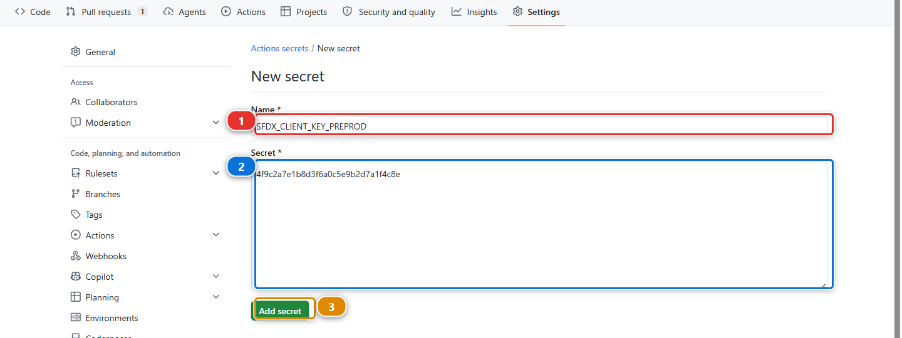

Back on the list, both names are there. The suffix is **the branch name in upper case**. That is
the whole convention, and it is why the names are not arbitrary.

!!! note "The orange warning about your pipeline YAML"
    Under the two values, the panel warns that on GitHub a secret also has to be passed to the job
    in `.github/workflows/*.yml`. It is right, and it is the step people forget: a secret GitHub
    holds and the workflow never reads is a secret the job does not have. This course's workflows
    already pass all eight, `SFDX_CLIENT_ID_*` and `SFDX_CLIENT_KEY_*` for the four branches, and
    this lab fills four of them. Open `.github/workflows/process-deploy.yml` and read its `env:`
    block once, because on your own project that block is yours to write.

Now click **Validate** on question 9, answer the last three questions, and let the command create
the app.

What it wrote, and where:

| What                              | Where                                                               | What it is                                             |
|-----------------------------------|---------------------------------------------------------------------|--------------------------------------------------------|
| Branch configuration              | `config/branches/.sfdx-hardis.preprod.yml`                          | `targetUsername`, `instanceUrl` and `mergeTargets`     |
| An encrypted private key          | `config/branches/.jwt/preprod.key`                                  | The credential itself, meant to be committed           |
| A certificate                     | `preprod.crt` in your home directory, deleted after the app deploys | What is uploaded into the org                          |
| An External Client App definition | deployed into the org by the command                                | What Salesforce authenticates against                  |
| Two values to store as secrets    | printed in the command panel                                        | `SFDX_CLIENT_ID_PREPROD` and `SFDX_CLIENT_KEY_PREPROD` |

The private key is **encrypted**, with a passphrase the command generates at random and that only
your secret holds. The repository alone is not enough to authenticate, which is what makes
committing the key acceptable.

### 7. Check the authorisation it did for you

The step everybody warns you about, pre-authorising the app, is the one the command already did:
the External Client App it deploys carries `Admin approved users are pre-authorized` and the profile
you named at the last question. Look at it once, so you know where it is when it matters.

In `helios-preprod`: **Setup > External Client App Manager**, open the app, whose name defaulted
to `sfdxhardispreprod`, then **Policies**. Permitted Users reads *Admin approved users are
pre-authorized*, and the profile is listed.

It matters because of the one path where it is **not** done for you: if the app deployment fails and
the command falls back to printing manual instructions, those instructions stop at uploading the
certificate. Follow them literally and the first CI login fails with `user hasn't approved this
consumer`, an accurate message that reads like a bug.

### 8. The same for main

Same gear, **Add/Configure Org**, once more, for production:

| Branch | Org           | Base URL answer                                                            | Merges into  | Secrets                                       |
|--------|---------------|----------------------------------------------------------------------------|--------------|-----------------------------------------------|
| `main` | `helios-prod` | **☢️ Other: Dev org, Production org or DevHub org (login.salesforce.com)** | tick nothing | `SFDX_CLIENT_ID_MAIN`, `SFDX_CLIENT_KEY_MAIN` |

Check the org twice: pointing production at the wrong org is the single most expensive mistake
available in this lab. And store both secrets, the ID and the key, as in step 6.

Four secrets, two External Client Apps, two keys. Tedious once, then never again.

### 9. Let contributors start a hotfix

Contributors choose where a User Story goes from a list, and `preprod` is not in it yet.

Open the **DevOps Pipeline** panel, the gear menu, **Pipeline Settings**. The page title reads
**Global Pipeline Settings**, and the scope selector **(1)** reads **Global Settings**.

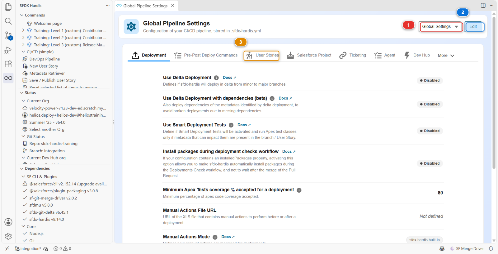

Click **Edit** **(2)**, then the **User Stories** tab **(3)**.

Two fields matter, and they are **two separate text boxes, one value per line**: **Available PR/MR
target branches (1)** and **Labels for available PR/MR target branches (2)**. Nothing pairs them
except their order, so line 2 of one belongs to line 2 of the other.

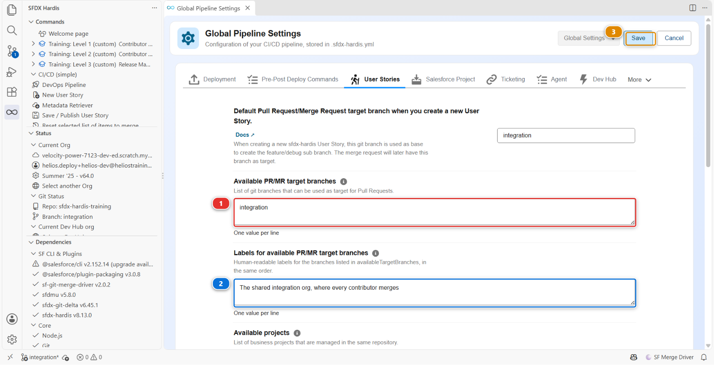

Today each holds a single line, the one a contributor has been choosing since Level 1. Add a second
line to each, in the same position:

| Line | Branch      | Label                                                                 |
|------|-------------|-----------------------------------------------------------------------|
| 1    | integration | `The shared integration org, where every contributor merges`          |
| 2    | preprod     | `Hotfixes on the production version, agreed with the release manager` |

`uat` and `main` are not in that list, on purpose. Nobody builds a User Story against them: work
reaches `uat` by promotion from `integration`, and `main` by promotion from `preprod`.

**Save (3)**.

!!! note "Looking for the production branch?"
    `productionBranch` has no field in the settings panel, and this project already carries it:
    `productionBranch: main`, in the Pipeline block of `config/.sfdx-hardis.yml`. A panel that
    covers most of a configuration and not all of it is normal, and it is why the under the hood
    sections of this course keep showing you the file.

### 10. Switch on promotion branches, for a week you hope not to have

One more setting, on the same panel, and it is the only one in this lab you are turning on for
something that has not happened yet.

Most weeks a release manager promotes a whole branch: everything that is in `uat` goes to `preprod`
together, because that is the version the testers tested. Some weeks the business signs off one
story and not the one next to it, and the release date does not move. sfdx-hardis has a Beta
feature for that week, **promotion branches**, and [Lab 3.10](3-10-promote-a-subset-with-promotion-branches.md) is where you use it.

Still in **Pipeline Settings**, scope **Global Settings**, open the **Danger Zone** tab.

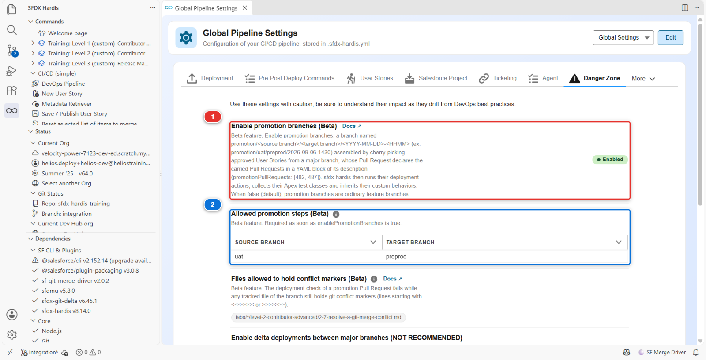

The tab opens on a warning, *Use these settings with caution, be sure to understand their impact as
they drift from DevOps best practices*, and it is there for every setting on it, this one included.

Click **Edit**, turn **Enable promotion branches (Beta)** **(1)** on, then add one row to **Allowed
promotion steps (Beta)** **(2)** with **Source branch** `uat` and **Target branch** `preprod`.
**Save**.

The second setting is required by the first, and it is a real decision rather than paperwork: it
says a release manager on this project may assemble a subset on the way into `preprod`, the stage in
front of production, and nowhere else. `sf hardis:project:promotion:create` refuses to run while the
list is missing instead of guessing that every major branch may promote into every other one.

**Nothing changes today.** With the feature on and no `promotion/...` branch in the repository, the
pipeline behaves exactly as it did a minute ago. It is switched on now because of where the setting
has to be by [Lab 3.10](3-10-promote-a-subset-with-promotion-branches.md), and the block below explains why that is not obvious.

Under the hood: why this cannot wait until the lab that needs it

`config/.sfdx-hardis.yml` gained:

    enablePromotionBranches: true
    allowedPromotionSteps:
      - source: uat
        target: preprod

A promotion branch is cut from its **target** branch, so the deployment job of its Pull Request
reads the configuration that `preprod` carries, not the one `integration` carries. A project
configuration only reaches `preprod` by travelling up the pipeline with the promotions, which on
this course happens in Labs 3.5 and 3.6.

Turn the feature on here and it arrives in `uat`, `preprod` and `main` on its own, with the rest of
the pipeline configuration, in time for [Lab 3.10](3-10-promote-a-subset-with-promotion-branches.md). Turn it on in [Lab 3.10](3-10-promote-a-subset-with-promotion-branches.md) instead and you would owe
yourself three merges before you could use it, which is exactly the kind of detail that makes a
Beta feature look broken when it is only late.

### 11. Publish the configuration through a Pull Request

Everything you did is files on your disk, on the User Story branch of step 4: the two new branch
files, the two keys, the target branches and the two promotion branch settings. They reach
`integration` the way every change does, through a Pull Request with green checks. The protection of
step 3 would refuse anything else.

You publish them the way you published a User Story in Level 1, with the same buttons.

**Commit them.** In the **Source Control** panel, stage the configuration files and commit them as
`Configure the pipeline up to production`, exactly as you staged metadata in [Lab 1.5](../level-1-contributor-basics/1-5-retrieve-commit-and-publish-your-changes.md).

**Publish.** In the **DevOps Pipeline** panel, click the **Save / Publish** card **(1)**, the one
every story has gone through since [Lab 1.5](../level-1-contributor-basics/1-5-retrieve-commit-and-publish-your-changes.md). It asks the target branch: `integration`. It commits
what is left, runs the cleaning, and pushes the branch.

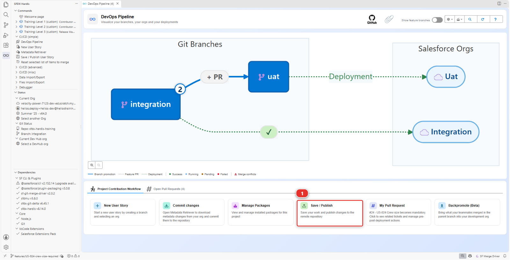

**Open the Pull Request.** When it finishes, the actions bar along the bottom starts with **Create
Pull Request** **(1)**. Click it: the extension opens GitHub on the Pull Request page for this
branch, already pointing at `integration`.

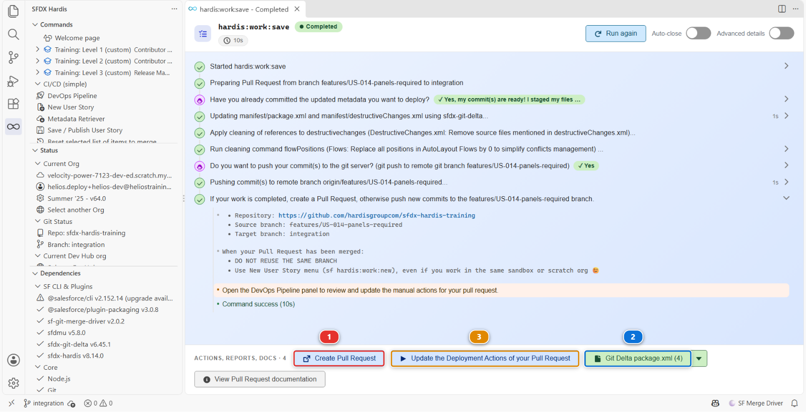

The same bar carries the `package.xml` the command generated **(2)** and the deployment actions of
this Pull Request **(3)**, as in [Lab 1.6](../level-1-contributor-basics/1-6-pull-request-deployment-check-and-merge.md). This branch changes no metadata, so both are short.

!!! tip "The shortcut this course keeps for later"
    **Training: Level 3** > **Publish my pipeline configuration** does all of the above in one
    click: branch, commit, push, Pull Request. Labs 3.5 and 3.8 use it, now that you have seen what
    it stands for. A real project has no such menu entry, which is why this lab does it by hand.

The check of this Pull Request logs into `helios-integration`, and it still does so with
`SFDX_AUTH_URL_INTEGRATION`, so a green check here says nothing about your keys. They prove
themselves the first time a Pull Request goes into `preprod` and into `main`, in
[Lab 3.6](3-6-release-to-production-and-read-dora-metrics.md), and that lab tells you where to look.

When both checks are green, merge with **Merge pull request**, not with a squash: this is not a
feature, and the configuration has to travel to `uat`, `preprod` and `main` with the promotions,
commit for commit ([Lab 1.6](../level-1-contributor-basics/1-6-pull-request-deployment-check-and-merge.md)). Then switch back to `integration`, from the branch name in the bottom left
corner of VS Code, and **Pull** in the **Source Control** panel: your `integration` gets the
configuration back, merged.

Under the hood: what the JWT flow actually does

The command ran:

    sf hardis:project:configure:auth

and every CI job on `preprod` or `main` now runs, before anything else:

    sf org login jwt \
      --client-id $SFDX_CLIENT_ID_PREPROD \
      --jwt-key-file <decrypted key> \
      --username <targetUsername from the branch config> \
      --instance-url <instanceUrl from the branch config> \
      --alias preprod

The private key is decrypted at the start of the job with `SFDX_CLIENT_KEY_PREPROD`, used, and
never written anywhere persistent.

**How the authentication hook chooses.** For a branch `<B>`, it looks for `SFDX_AUTH_URL_<B>` first,
in that spelling and then upper-cased. If it finds one, it uses it and returns, before the JWT
variables are even read. Only if there is none does it go on to `SFDX_CLIENT_ID_<B>` plus the key.
That order is why `integration` and `uat` keep working untouched: their auth URL secret is found
first, and they have no key to look for.

The JWT lookup also accepts a plain `SFDX_CLIENT_ID` with no suffix, as a last resort and with a
warning in the log: a single unsuffixed secret left over from an old setup answers for every branch.

`config/.sfdx-hardis.yml` still says `orgAuthenticationMode: secretsOnly`, and that is deliberate.
That setting only tells the DevOps Pipeline panel which shape to expect, and no CLI command reads
it: `encryptedCert` would make the panel warn about the missing keys of `integration` and `uat`,
which on this course stay on their auth URL.

<!-- command-links:start -->
Command documentation: [hardis:project:configure:auth](https://sfdx-hardis.cloudity.com/hardis/project/configure/auth/)
<!-- command-links:end -->

Under the hood: the files you just published

`config/.sfdx-hardis.yml` gained:

    availableTargetBranches:
      - integration
      - preprod
    availableTargetBranchesLabels:
      - "The shared integration org, where every contributor merges"
      - "Hotfixes on the production version, agreed with the release manager"
    enablePromotionBranches: true
    allowedPromotionSteps:
      - source: uat
        target: preprod

and `config/branches/` now holds four files, each with `targetUsername`, `instanceUrl` and
`mergeTargets`, plus a `.jwt` folder with two encrypted keys, `preprod.key` and `main.key`.

**A major branch is not declared anywhere as "major".** It becomes one by having a branch
configuration file with an org in it. That is the whole mechanism, and knowing it means you can read
any sfdx-hardis project in two minutes by listing `config/branches/`. Every screen that reads major
branches, the pipeline diagram and the scope selector of Pipeline Settings included, is reading that
folder.

`sf hardis:project:create` would have generated the skeleton of a new project: the workflows for
every git provider, `.mega-linter.yml`, `projectName`, `developmentBranch` and `autoCleanTypes`. It
writes no `config/branches/` file and asks for no org but the Dev Hub: the branch files are
Add/Configure Org's job, as above. The command that takes an existing org with no repository at all
and produces the first commit is `sf hardis:org:retrieve:sources:dx`, the real starting point of
most projects.

<!-- command-links:start -->
Command documentation: [hardis:project:create](https://sfdx-hardis.cloudity.com/hardis/project/create/), [hardis:org:retrieve:sources:dx](https://sfdx-hardis.cloudity.com/hardis/org/retrieve/sources/dx/)
<!-- command-links:end -->

### 12. Look at the diagram again

Open the **DevOps Pipeline** panel and click **Refresh**. This is the pipeline you built:

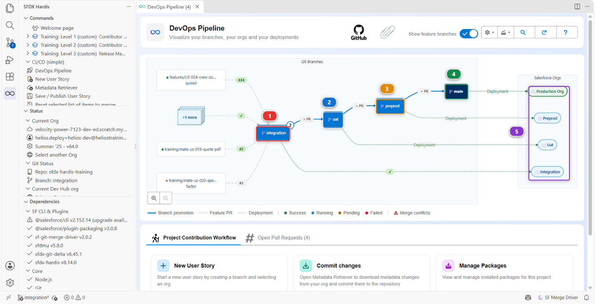

1. **`integration`** **(1)**, where contributors merge, with the promotion arrow leaving it
2. **`uat`** **(2)**, where the business signs off
3. **`preprod`** **(3)**, the rehearsal of production, and where hotfixes start
4. **`main`** **(4)**, production
5. The four orgs **(5)**, one per branch, in the order the work travels through them

That diagram is now the truth about this project, and the thing you point at when a stakeholder asks
"so where is it". The **+ PR** buttons on the arrows are the promotion Pull Requests, and [Lab 3.5](3-5-promote-to-uat-and-write-release-notes.md) is
the first time you click one.

## What you should see

- Four branch protection rules in **Settings** > **Branches** of your fork, `integration`, `uat`,
  `preprod` and `main`, each requiring a Pull Request and the two checks
- `config/branches/` on `integration` holding four files and two `.jwt/*.key` files, `preprod.key`
  and `main.key`
- Four new secrets in your fork, `SFDX_CLIENT_ID_PREPROD`, `SFDX_CLIENT_KEY_PREPROD`,
  `SFDX_CLIENT_ID_MAIN` and `SFDX_CLIENT_KEY_MAIN`, next to the two auth URL secrets of Level 1
- Your configuration Pull Request merged into `integration`
- The DevOps Pipeline panel with four columns
- `enablePromotionBranches` and one allowed step in the Danger Zone of Pipeline Settings, doing
  nothing until [Lab 3.10](3-10-promote-a-subset-with-promotion-branches.md)

## If it goes wrong

**preprod is not in the branch list of Add/Configure Org.**
VS Code has not fetched it. **Source Control** panel, **...** menu, **Pull, Push** > **Fetch**, then
run the command again.

**The org list offers a `helios-` org that no longer exists.**
It happens when a scratch org expired and **Set up my training environment** built a new one under
the same alias: the command lists the orgs from a cache, and the cache still holds the old one.
Picking it makes the command stop straight after "Selected Org", with none of the questions asked.
The last answer of the list is the way out: **😱 I already authenticated my org but I don't see it !**
clears that cache. Then run **Add/Configure Org** again and the list is right.

**The preprod column appears with no org.**
The branch file was written for another branch name. Check `config/branches/` for a typo: the file
name has to match the branch exactly.

**`user hasn't approved this consumer`.**
Step 7: the External Client App exists but the user is not pre-authorised.

**`invalid_grant: audience is invalid`.**
The instance URL does not match the org type: `https://test.salesforce.com` for a scratch org or a
sandbox, `https://login.salesforce.com` for a Developer Edition org. Check the branch file of the job
that failed.

**The job cannot decrypt the key.**
`SFDX_CLIENT_KEY_<BRANCH>` is missing, wrong, or was copied with a trailing newline. Recreate it.

**`client identifier invalid`.**
The External Client App behind that consumer key was never created: the command stopped after it
printed the two values. Run **Add/Configure Org** again for that branch, store the two new values,
and publish again.

**Add/Configure Org stops asking whether you deleted the External Client App.**
You are running it a second time for that branch, and the app it deploys is already in the org, so
it asks you to remove the old one first: *External Client App named `sfdxhardis<branch>` already
exists ... Have you deleted it?* In the org, **Setup > External Client App Manager**, delete that
app, then answer yes. It is the normal path whenever an entry above sends you back through
**Add/Configure Org**.

**Add/Configure Org stops straight after "Selected Org", with none of the questions asked.**
The org list offered a `helios-` org that no longer exists, usually because a scratch org was
rebuilt under the same alias. See the entry above: the last answer of the list,
**I already authenticated my org but I don't see it !**, clears that cache.

**Save / Publish is refused, and you are still on `integration`.**
Step 4 was skipped, so the files were written on `integration`, which takes nothing directly.
**Ctrl+Shift+P**, **Git: Create Branch...**, and name it `features/US-050-pipeline-up-to-production`:
the new branch starts from where you are, with your commit and any file not committed yet. Then
**Save / Publish** again. If instead a configuration file you changed was also changed on GitHub,
pull in the **Source Control** panel, then publish again.

**The check you want to require is not suggested.**
GitHub only lists checks that reported on this repository in the last seven days. Open a Pull
Request into `integration`, let its checks run, and come back to the rule.

**Set up my training environment fails with `There is already a Child Relationship named
Installations on Account`.**
You cleaned that org up with **Clean up a training org** and are now putting the app back. Deleting
a custom object does not erase it: it sits in **Setup > Objects and Fields > Deleted Objects** and
keeps its relationship names reserved, so the app cannot be created again next to it. Erase it
there, then run **Set up my training environment** again. On a scratch org it is quicker to let
**Set up my training environment** build a new one.

**Set up one of my training orgs fails on `helios-prod`.**
The usual cause is an expired connection: reconnect it in **Orgs Manager** under the same alias, and
run it again.

## Check your work

Welcome page > **Training: Level 3** > **Check my work**, then pick **Lab 3.1**.

## Go deeper

- [Setup Guide](https://sfdx-hardis.cloudity.com/salesforce-devops-setup-home/)
- [Configure CI authentication](https://sfdx-hardis.cloudity.com/salesforce-devops-setup-auth/)
- [GitHub Actions authentication](https://sfdx-hardis.cloudity.com/salesforce-devops-setup-auth-github/)
- [Retrieve an existing org](https://sfdx-hardis.cloudity.com/salesforce-devops-setup-existing-org/)

[Next: Lab 3.2 - Review and merge a contributor Pull Request](3-2-review-a-contributor-pull-request.md){ .md-button .md-button--primary }
