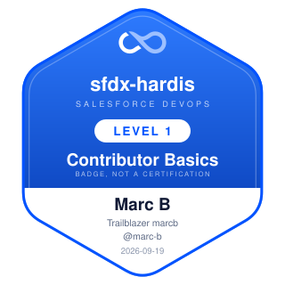
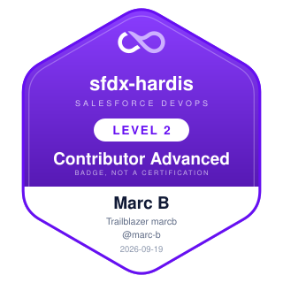
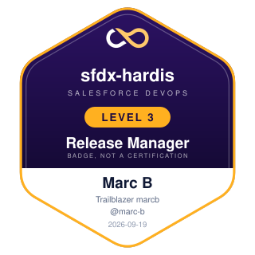
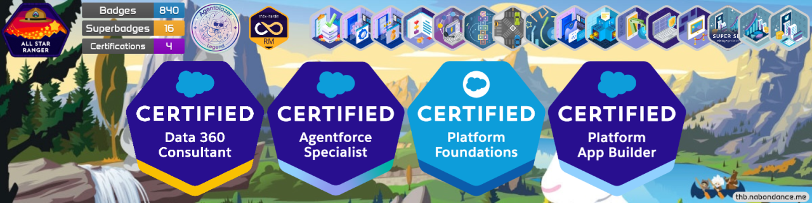

# Formation Salesforce DevOps avec sfdx-hardis

Trois parcours gratuits qui vous emmènent de "je n'ai jamais utilisé Git" à "la pipeline, c'est moi
qui la gère".

Vous travaillerez sur un vrai repository, celui d'un installateur de panneaux solaires fictif,
**Helios Energy**, avec des orgs Salesforce gratuites livrées avec l'application et ses données.
Tout ce que vous faites ici est ce qu'une vraie équipe Salesforce fait tous les jours, avec les
mêmes outils.

Si Git est nouveau pour vous, c'est exactement le point de départ prévu. Le Niveau 1 définit les six
mots dont vous avez besoin, repository et fork compris, au moment où vous rencontrez chacun d'eux,
et l'extension VS Code lance les commandes Git à votre place.

!!! info "Les outils restent en anglais"
    Le cours suppose que sfdx-hardis, son extension VS Code et votre org Salesforce sont en
    **anglais**, comme sur toutes les captures d'écran. Les noms de boutons, de panneaux et de
    menus sont donc laissés en anglais dans le texte : ce que vous lisez ici est exactement ce que
    vous voyez à l'écran.

## Les trois niveaux

| Niveau                                                                 | Pour qui                                                            | Durée | Prérequis          | À la fin, vous savez                                                                                               |
|------------------------------------------------------------------------|---------------------------------------------------------------------|-------|--------------------|--------------------------------------------------------------------------------------------------------------------|
| [**1 - Contributeur, les bases**](level-1-contributor-basics/index.md) | Admins et développeurs qui rejoignent une équipe ayant une pipeline | 2 h   | Rien               | Prendre une User Story, la construire, la publier, obtenir une Pull Request verte, la merger                       |
| [**2 - Contributeur avancé**](level-2-contributor-advanced/index.md)   | Les mêmes, une fois les histoires faciles derrière eux              | 4 h   | Niveau 1           | Résoudre les erreurs de déploiement, déclarer des deployment actions, gérer les écrasements, résoudre les conflits |
| [**3 - Release Manager**](level-3-release-manager/index.md)            | Celui ou celle qui tient la pipeline, les orgs et les releases      | 7 h   | Niveaux 1 **et** 2 | Reprendre une org sans pipeline, relire et merger, livrer en UAT et en production, faire un hotfix, monitorer      |

Les niveaux 1 et 2 forment ensemble le parcours contributeur, et ils s'adressent **autant aux admins
qu'aux développeurs**. Nul besoin de connaître Git, la CLI Salesforce ou le DevOps : chaque étape est
un clic dans VS Code ou sur GitHub, avec une capture d'écran à l'appui. Vous pouvez vous arrêter
après le Niveau 1 et vous saurez livrer. Le Niveau 2, c'est là que vous apprenez quoi faire quand la
livraison se passe mal, ce qui représente l'essentiel du métier.

!!! tip "Développeurs : ouvrez les blocs Sous le capot"
    Chaque étape importante se termine par un bloc replié **Sous le capot** : la commande que le
    bouton a lancée, les fichiers qu'elle a écrits, et la décision qu'elle a prise à votre place. Un
    admin peut les sauter. Un développeur devrait tous les lire : c'est ainsi que vous apprenez ce
    que fait sfdx-hardis, et c'est ce dont vous aurez besoin le jour où vous le scripterez, où vous
    déboguerez une pipeline, ou où vous attaquerez le Niveau 3.

**Le Niveau 2 est obligatoire avant le Niveau 3.** Un release manager relit les erreurs de
déploiement, les conflits et les deployment actions des autres. Quelqu'un qui n'en a jamais résolu
un seul ne peut pas les relire.

## Ce qu'il vous faut

- Un ordinateur sur lequel vous avez le droit d'installer des logiciels. Le Lab 1.1 déroule ce qu'il
  faut installer, un téléchargement à la fois, captures d'écran comprises. Rien à installer, ou pas
  le droit ? [Agentforce Vibes](https://www.salesforce.com/agentforce/developers/vibe-coding/ide/) est VS Code dans un
  onglet, lancé depuis une sandbox de développement ou depuis l'org Developer Edition gratuite pour
  laquelle le Lab 1.2 vous inscrit, et le cours y fonctionne aussi, comme dans [Cursor](https://cursor.com/) et les autres éditeurs construits sur VS Code.
- Un compte [GitHub](https://github.com/), gratuit.
- Une org [Salesforce Developer Edition gratuite](https://developer.salesforce.com/signup) pour
  commencer, et une deuxième au Niveau 3. Le Lab 1.2 vous y inscrit, et crée à partir de celle-là
  les autres orgs dont le cours a besoin.
- Rien d'autre. Aucun service payant, aucune licence, aucune carte bancaire.

## Ce que vous obtenez

Un **badge Cloudity** par niveau, sur une page que vous pouvez partager. Il porte votre nom tel que
votre profil GitHub l'affiche, vos identifiants GitHub et Trailblazer, et la date. Voici les trois
que Marc B a obtenus :

{ width="200" }
{ width="200" }
{ width="200" }

**Claim my badge**, dans le menu Training de chaque niveau, vérifie votre travail une dernière fois
et ouvre la demande pour vous. Un job rejoue ensuite tous les contrôles du niveau sur votre
repository et publie la page du badge.

C'est un badge, pas une certification. Il n'y a ni examen ni accréditation. Partagez-le dans
*Featured* sur LinkedIn, pas dans *Licenses & certifications*.

Votre badge apparaît aussi sur votre bannière Trailhead.
[Trailhead Banner](https://thb.nabondance.me/) dessine une image de couverture LinkedIn à partir
d'un nom d'utilisateur Trailblazer : le rang, les compteurs de badges, les certifications, et le
badge sfdx-hardis le plus élevé que vous avez réclamé. Tapez votre nom d'utilisateur Trailblazer,
générez l'image, et mettez-la en bannière de votre profil LinkedIn.

## Sous le capot, à chaque fois

Chaque lab est écrit sous forme de clics dans l'extension VS Code, parce que c'est ainsi que le
produit est fait pour être utilisé. Chaque étape importante se termine ensuite par un bloc **Sous le
capot** qui nomme la commande exacte qui a tourné et les fichiers qu'elle a touchés, pour que vous
repartiez avec un modèle mental plutôt qu'un réflexe moteur.

## Commencer

[Niveau 1 - Contributeur, les bases](level-1-contributor-basics/index.md){ .md-button .md-button--primary }

[Read this course in English](../en/index.md)
