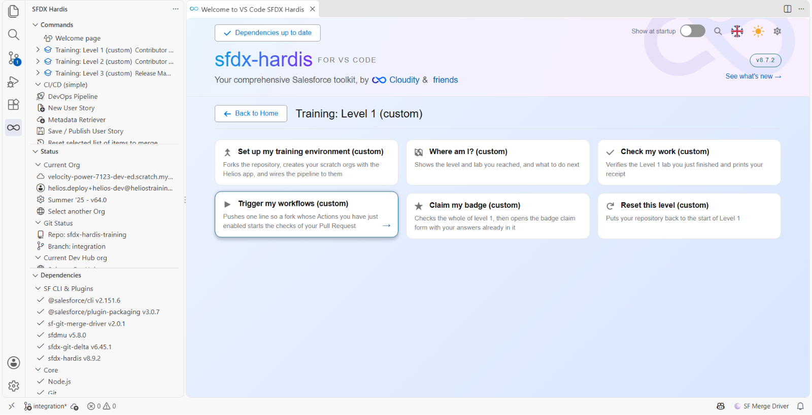
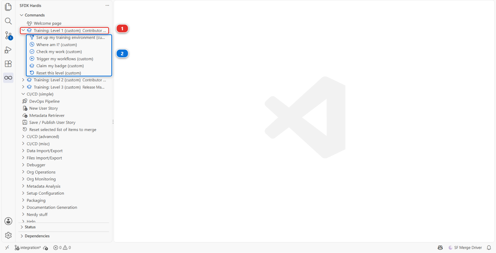

# Niveau 1 - Contributeur Salesforce DevOps, les bases

**Durée** : environ 2 h 15, en une fois ou en sept.

**Prérequis** : aucun. C'est le premier niveau.

## L'histoire

Vous avez rejoint **Helios Energy** lundi. Ils installent des panneaux solaires résidentiels dans
toute l'Europe du Sud, les ventes tournent sur Salesforce, et les équipes de pose suivent chaque
installation dans une application sur mesure appelée **Helios Delivery**.

L'équipe a déjà une pipeline. Il y a un repository Git, une org d'intégration, un contrôle de Pull
Request qui déploie votre travail avant que quiconque le relise. Personne ne va vous apprendre Git :
l'extension VS Code fait la partie technique, et d'ici vendredi on attend de vous que vous ayez
livré votre première story.

C'est ce niveau.

## Six mots, avant tout le reste

Si vous n'avez jamais utilisé Git, voici tout le vocabulaire. Rien dans le Niveau 1 ne suppose que
vous le connaissiez déjà, et vous n'aurez pas une seule commande Git à taper : l'extension VS Code
s'en charge.

| Mot              | Ce que ça veut dire                                                                                                                                                        |
|------------------|----------------------------------------------------------------------------------------------------------------------------------------------------------------------------|
| **Repository**   | Un dossier de projet, plus toutes les versions qu'il a jamais eues. On dit "repository", souvent raccourci en "repo". Le repo Helios vit sur GitHub.                       |
| **Fork**         | Votre copie personnelle du repository de quelqu'un d'autre, faite en un clic, sous votre compte GitHub. Vous pouvez tout y changer, et l'original ne s'en aperçoit jamais. |
| **Clone**        | Télécharger un repository sur votre portable, pour que VS Code puisse l'ouvrir.                                                                                            |
| **Branch**       | Une ligne de travail nommée à l'intérieur d'un repository. Vous changez ce qu'il faut sur la vôtre, et la version de l'équipe reste intacte jusqu'au merge.                |
| **Commit**       | Enregistrer un ensemble de modifications dans l'historique du repository, avec un message qui dit pourquoi.                                                                |
| **Pull Request** | Demander que votre branche soit fusionnée dans celle de l'équipe. C'est là que les contrôles tournent et qu'un collègue lit ce que vous avez fait. Tout le monde dit "PR". |

## Ce que vous allez faire

| Lab                                                         | Titre                                                              | Durée  |
|-------------------------------------------------------------|--------------------------------------------------------------------|--------|
| [1.1](1-1-install-vs-code-and-sfdx-hardis.md)               | Installer VS Code, Git et sfdx-hardis                              | 15 min |
| [1.2](1-2-create-your-dev-hub-scratch-orgs-and-pipeline.md) | Créer votre Dev Hub, vos scratch orgs et votre pipeline CI/CD      | 30 min |
| [1.3](1-3-start-a-user-story-on-a-git-branch.md)            | Démarrer une User Story sur sa propre branche Git                  | 10 min |
| [1.4](1-4-build-a-custom-field-in-your-org.md)              | Construire un champ personnalisé dans votre org Salesforce         | 15 min |
| [1.5](1-5-retrieve-commit-and-publish-your-changes.md)      | Récupérer, commiter et publier vos modifications Salesforce        | 20 min |
| [1.6](1-6-pull-request-deployment-check-and-merge.md)       | Ouvrir une Pull Request, passer le contrôle de déploiement, merger | 20 min |
| [1.7](1-7-capstone-deliver-a-user-story-on-your-own.md)     | Épreuve finale : livrer une User Story tout seul                   | 25 min |

## Le menu Training

Tout ce que ce cours vous demande de lancer en dehors des boutons du produit lui-même tient dans un
seul menu. Ouvrez la **Welcome page**, et sous **CUSTOM MENUS** cliquez sur la carte
**Training: Level 1**. Ses commandes prennent alors toute la page :

Elles sont sept, et les labs les appellent par ces noms :

| Commande                           | Ce qu'elle fait                                                                                       |
|------------------------------------|-------------------------------------------------------------------------------------------------------|
| **Set up my training environment** | Forke le repository, crée vos scratch orgs avec l'application, câble la pipeline                      |
| **Where am I?**                    | Dit à quel niveau et à quel lab vous en êtes, et ce qu'il faut faire ensuite                          |
| **Check my work**                  | Vérifie le lab que vous venez de terminer et affiche votre reçu                                       |
| **Trigger my workflows**           | Démarre les contrôles de votre Pull Request quand Actions était coupé sur le fork                     |
| **Claim my badge**                 | Contrôle le niveau entier, puis ouvre votre demande de badge déjà remplie                             |
| **Update my course**               | Apporte les changements reçus par le cours depuis votre fork, par une Pull Request vers `integration` |
| **Reset this level**               | Remet votre repository au début du Niveau 1                                                           |

Il y a un menu par niveau, et chacun ne contient que ce dont ce niveau a besoin : rien de ce que vous
avez sous les yeux ne concerne un lab que vous n'avez pas encore atteint.

Les mêmes commandes sont dans la vue **SFDX HARDIS** de la barre de gauche, sous
**Training: Level 1** **(1)**, une par ligne **(2)**. Les deux chemins lancent la même chose, et les
labs citent la Welcome page parce qu'une carte se montre plus facilement qu'une ligne.

## Trois choses vraies pour tout le cours

**Vous travaillez dans votre propre copie.** Tout ce qui se passe dans ce cours se passe dans un
repository qui n'appartient qu'à vous. Vos modifications, vos erreurs, vos corrections, et rien de
ce que vous faites n'atteint le travail de qui que ce soit d'autre. Le Lab 1.2 met cette copie en
place pour vous en un clic, et explique pourquoi il ne peut pas en être autrement.

**Vous cliquez, vous ne tapez pas de ligne de commande.** Chaque action de ces labs est un bouton de l'extension VS Code.
Là où une commande apparaît, c'est dans un bloc **Sous le capot**, qui explique ce que le bouton a
fait. Vous n'avez jamais à la retaper.

**Vous pouvez toujours repartir de zéro.** Si un lab tourne mal, Welcome page >
**Training: Level 1** > **Reset this level** remet votre repository au début du niveau. Un lab raté ne met
pas fin à votre formation.

## Si vous êtes bloqué

Chaque lab a une section **En cas de problème** avec les deux ou trois échecs que nous savons
possibles. Au-delà, la documentation sfdx-hardis sur
[sfdx-hardis.cloudity.com](https://sfdx-hardis.cloudity.com/) est la référence, et chaque lab pointe
les pages exactes de son sujet.

[Commencer par le Lab 1.1](1-1-install-vs-code-and-sfdx-hardis.md){ .md-button .md-button--primary }
