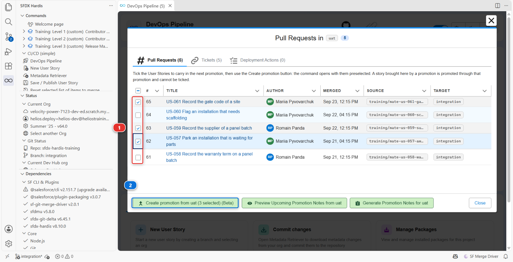
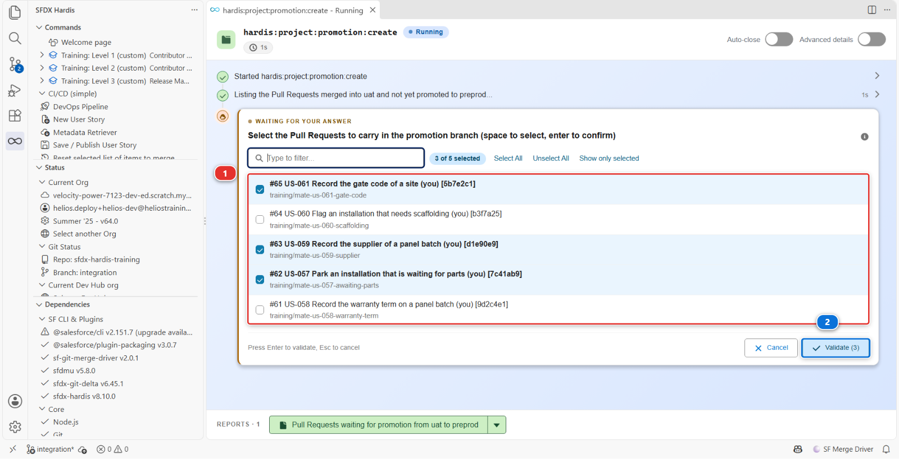
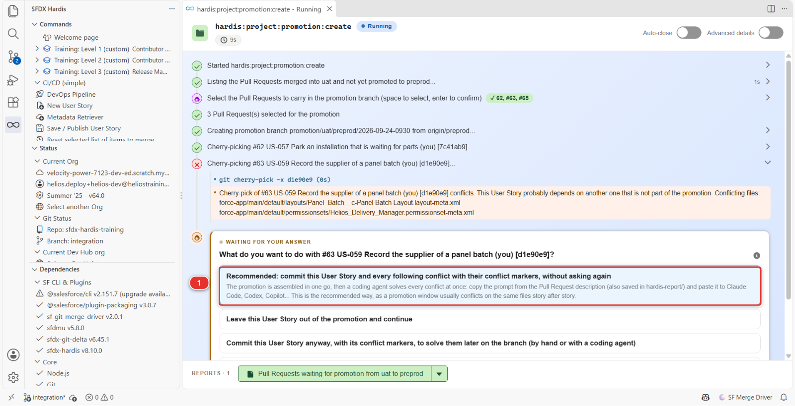
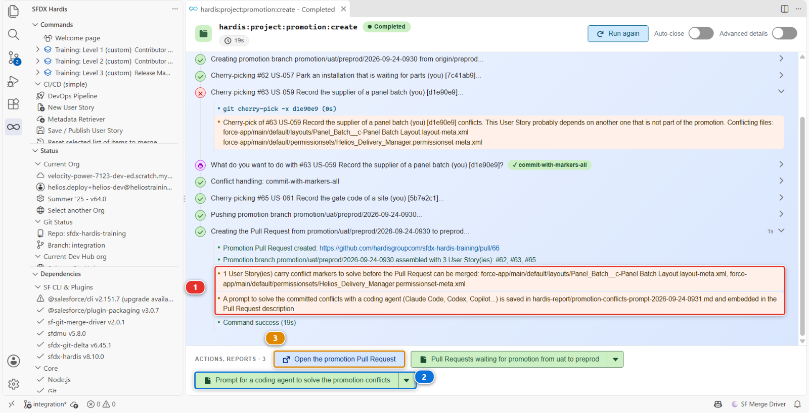
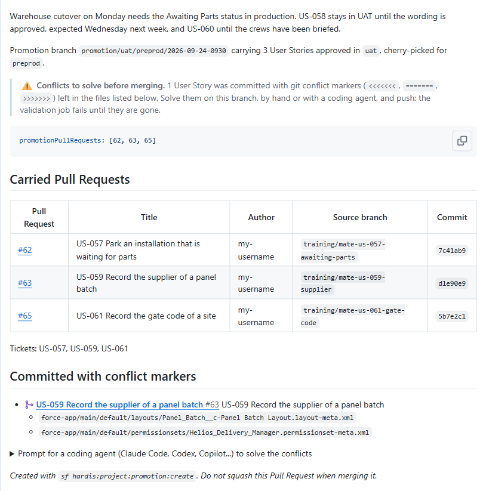
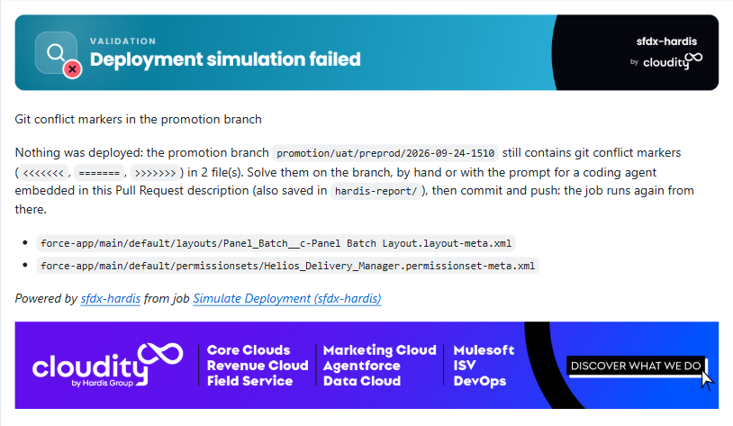
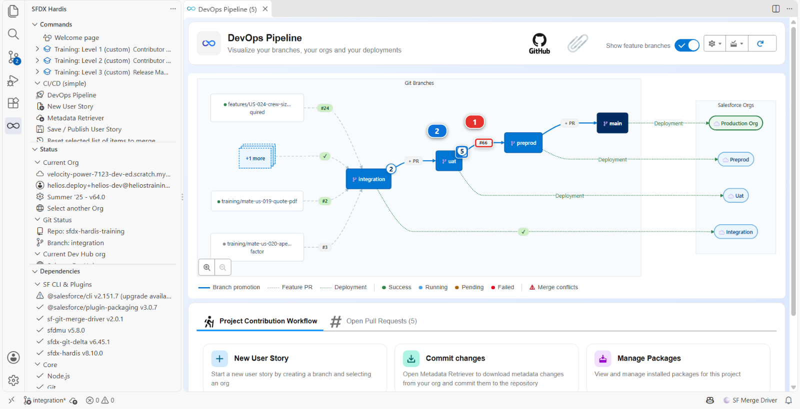
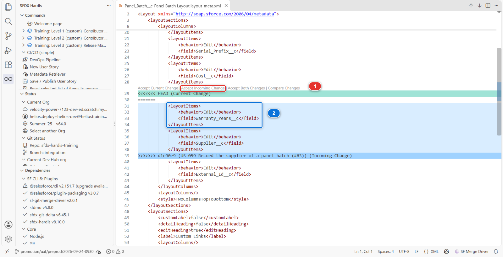

# Lab 3.10 - Promouvoir un sous-ensemble avec les promotion branches (Beta)

**Niveau** : 3 Release Manager

**Durée** : ~55 min

**Vous allez** : livrer en preprod trois User Stories approuvées pendant que deux autres restent en
UAT, résoudre le conflit que l'une d'elles traîne avec elle, et remettre la pipeline d'aplomb
ensuite, avec la seule fonctionnalité de sfdx-hardis dont vous devriez espérer ne jamais avoir
besoin deux semaines de suite.

## La situation

Cinq stories sont arrivées cette semaine, et les cinq sont en UAT.

**US-058**, celle de Romain, stocke la durée de garantie sur un panel batch. Elle fonctionne.
Personne n'a validé la formulation, parce que la personne qui valide les formulations est absente
jusqu'au milieu de la semaine prochaine.

**US-057**, celle de Mariia, donne aux planificateurs un statut *Awaiting Parts* pour une
installation bloquée par une pièce manquante. Le responsable des opérations l'a testée mardi et l'a
validée par écrit.

**US-059**, encore Romain, stocke le fournisseur sur un panel batch. Il l'a écrite le lendemain
d'US-058, et a placé le nouveau champ juste sous la durée de garantie sur la présentation de page,
parce que les deux viennent de la même facture. L'acheteur l'a validée mercredi.

**US-060**, celle de Mariia, signale une installation qui a besoin d'un échafaudage. Elle fonctionne
aussi, et le responsable des opérations la retient : les équipes n'ont pas été informées de ce
qu'elles doivent faire d'un site signalé, et un signal que personne ne suit est pire que pas de
signal.

**US-061**, celle de Mariia, met le code du portail du site sur l'installation. Les chefs d'équipe
l'ont testée mardi et la veulent avant le week-end.

La livraison est jeudi et la date ne bouge pas : la bascule de l'entrepôt a besoin du nouveau statut
en production avant le week-end.

Vous avez donc une fenêtre de promotion qui contient trois stories approuvées et deux stories
auxquelles personne n'a dit oui, et la promotion ordinaire est tout ou rien. Elle transporte `uat`
telle qu'elle est, US-058 et US-060 comprises.

!!! warning "C'est l'exception, et elle doit le rester"
    Promouvoir des branches plutôt que des fonctionnalités est la manière recommandée, et tous les
    autres labs de ce niveau le font. Une version dont les stories ont été testées ensemble est la
    version qui a été testée.

    Une promotion branch casse cela volontairement. Après elle, `uat` et `preprod` ne contiennent
    plus la même chose, les orgs derrière divergent, et la production fait tourner une combinaison
    que personne n'a jamais testée dans son ensemble. C'est un coût réel, payé plus tard, en général
    par la personne d'astreinte.

    Utilisez-la quand une date ne peut pas bouger et qu'une validation n'est pas arrivée. N'en
    faites pas un processus : une équipe qui assemble une promotion branch toutes les semaines a un
    problème de validation, pas un problème d'outillage, et cela se corrige en amont.

## Avant de commencer

- [ ] [Lab 3.9](3-9-generate-the-project-documentation.md) terminé
- [ ] Les quatre branches déploient, et les quatre orgs sont connectées
- [ ] `enablePromotionBranches` et `allowedPromotionSteps` publiés au
      [Lab 3.1](3-1-configure-the-pipeline-up-to-production.md), et remontés jusqu'à `preprod` par les promotions des Labs 3.5 et 3.6
- [ ] Rien en attente dans le panneau **Source Control** qui vous tienne encore à cœur

## Les étapes

### 1. Vérifier que la fonctionnalité est active, et où elle est autorisée

Les deux réglages dont ce lab a besoin ont été publiés au [Lab 3.1](3-1-configure-the-pipeline-up-to-production.md) et remontent la pipeline avec
chaque promotion depuis. Regardez-les avant de compter dessus.

Ouvrez le panneau **DevOps Pipeline**, le menu engrenage, **Pipeline Settings**, portée **Global
Settings**, puis l'onglet **Danger Zone**.


Lisez la ligne en haut de cet onglet avant tout le reste : *Use these settings with caution, be sure
to understand their impact as they drift from DevOps best practices.* Le produit range cette
fonctionnalité dans le même tiroir que les déploiements delta entre branches majeures, et pour la
même raison.

**Enable promotion branches (Beta)** **(1)** affiche **Enabled** : la fonctionnalité est active pour
tout le projet. **Allowed promotion steps (Beta)** **(2)** contient une ligne, source `uat` et cible
`preprod`, et dit que c'est la seule étape sur laquelle un release manager peut ici assembler une
promotion.

Ce deuxième réglage n'est pas de la paperasse. C'est la raison pour laquelle le bouton que vous
allez utiliser existe sur `uat` et pas sur `integration` : un sous-ensemble est une décision sur ce
qui part vers l'étape juste avant la production, et personne n'a besoin de la prendre en entrant
dans une org d'intégration qui est reconstruite depuis la branche de toute façon.
`sf hardis:project:promotion:create` refuse purement et simplement de tourner tant que la liste est
absente, plutôt que de deviner que chaque branche majeure peut promouvoir vers toutes les autres.

<details markdown="1"><summary>Sous le capot : pourquoi un réglage publié au [Lab 3.1](3-1-configure-the-pipeline-up-to-production.md) compte maintenant</summary>

Les deux réglages sont au niveau projet, dans `config/.sfdx-hardis.yml` :

    enablePromotionBranches: true
    allowedPromotionSteps:
      - source: uat
        target: preprod

Le job de déploiement d'une Pull Request de promotion tourne sur la promotion branch, et une
promotion branch est coupée depuis sa **cible** : la configuration qu'il lit est donc celle que
porte `preprod`. Un réglage activé aujourd'hui dans `integration` ne serait pas dans `preprod` avant
qu'une promotion l'y porte, et d'ici là le job traiterait la Pull Request de promotion comme une
branche de fonctionnalité ordinaire : il déploierait quand même, et il ignorerait silencieusement
les stories que la branche déclare.

C'est pour cela que le réglage a été publié au [Lab 3.1](3-1-configure-the-pipeline-up-to-production.md) avec le reste de la configuration du
pipeline, et pour cela qu'il est resté inerte depuis : sans aucune promotion branch dans le
repository, un projet avec la fonctionnalité active se comporte exactement comme un projet sans.

</details>

### 2. Prendre les cinq stories, dans l'ordre, et les promouvoir comme d'habitude

Rien de nouveau ici, c'est donc écrit court. Si une étape ne vous dit rien, le lab qui l'a enseignée
est en lien.

**Welcome page** > **Training: Level 3** > **Simulate my teammates**, et prenez les cinq **une à la
fois, dans cet ordre, en mergeant chacune dans `integration` avant de prendre la suivante** :

1. **US-058 Record the warranty term on a panel batch**
2. **US-057 Park an installation that is waiting for parts**
3. **US-059 Record the supplier of a panel batch**
4. **US-060 Flag an installation that needs scaffolding**
5. **US-061 Record the gate code of a site**


L'ordre est la semaine telle qu'elle s'est passée, et il compte deux fois. US-059 a été écrite
par-dessus US-058 : Romain a coupé sa branche après le merge de la durée de garantie, et a placé le
champ fournisseur juste dessous. La simulation refuse de construire US-059 tant qu'US-058 n'est pas
dans `integration`, et vous le dit. Et l'ordre dans lequel les stories ont été mergées est l'ordre
dans lequel la fenêtre de `uat` les liste, que l'étape 4 lit de haut en bas.

Relisez chacune avec les quatre questions du [Lab 3.2](3-2-review-a-contributor-pull-request.md) et mergez-la avec **Squash and merge**, comme
toute Pull Request de fonctionnalité de ce cours. Vous n'avez pas à attendre chaque déploiement
avant de merger la suivante : ils se mettent en file sur `integration`. Quand le dernier est vert,
promouvez `integration` vers `uat` comme au [Lab 3.5](3-5-promote-to-uat-and-write-release-notes.md) : la pastille **+ PR** sur la flèche, un titre
lisible par un humain, **Merge pull request** et jamais de squash.

Les cinq stories sont maintenant dans `uat`, déployées dans `helios-uat`, et c'est le moment que
toute vraie semaine finit par atteindre : tout est testable, et une partie seulement est approuvée.

<details markdown="1"><summary>Sous le capot : comment la simulation sait qu'US-059 a besoin d'US-058</summary>

Chaque story de coéquipier est un scénario sous `scripts/simulate/`, et
`us-059-supplier/scenario.json` porte une ligne que les autres n'ont pas :

    "basedOn": "us-058-warranty-term"

Avant de couper la branche depuis votre `integration`, la commande vérifie que chaque changement
d'US-058 y est : le fichier du champ, sa ligne sur la présentation de page, son droit sur le
permission set. Sans eux, le patch d'US-059 n'a aucune ligne où s'accrocher, puisqu'il place
`Supplier__c` après `Warranty_Years__c`. La vérification transforme un obscur « cannot be placed »
en une phrase qui nomme la story à merger d'abord.

</details>

### 3. Décider, avant de toucher à quoi que ce soit

Vous avez trois options et l'outil n'en sert qu'une. Sachez pourquoi vous choisissez celle-là.

| Option                                          | Ce qu'elle coûte                                                                                                                                                                                                                     | Quand elle est la bonne                                                                                                       |
|-------------------------------------------------|--------------------------------------------------------------------------------------------------------------------------------------------------------------------------------------------------------------------------------------|-------------------------------------------------------------------------------------------------------------------------------|
| **Attendre les validations**                    | La livraison glisse d'une semaine                                                                                                                                                                                                    | Presque toujours. C'est la seule option qui garde les orgs alignées                                                           |
| **Sortir US-058 et US-060 de `uat`**            | Deux reverts, chacun sur une feature branch à part qui passe par `integration` puis `uat` comme n'importe quelle story, jamais un commit directement sur `uat`, et les deux stories devront revenir plus tard, rebasées et retestées | Quand une story est vraiment mauvaise, pas simplement non validée                                                             |
| **Transporter US-057, US-059 et US-061 seules** | `uat` et `preprod` divergent jusqu'à la prochaine promotion complète, et il faut décrocher US-059 d'US-058                                                                                                                           | Quand la date est fixe, que les validations n'arriveront pas, et que les stories laissées derrière sont bien là où elles sont |

Cette semaine, c'est la troisième, et la raison est écrite : la bascule de l'entrepôt.

Écrivez cette raison quelque part où un successeur la trouvera. La Pull Request que vous allez créer
est un bon endroit, et l'étape 7 y revient.

### 4. Choisir ce qui part

Ouvrez le panneau **DevOps Pipeline** et cliquez sur le nœud `uat`. La fenêtre qui s'ouvre est celle
que le [Lab 3.5](3-5-promote-to-uat-and-write-release-notes.md) utilisait pour lire une fenêtre de promotion, avec deux choses dessus qui ne
servaient à rien jusqu'ici.



Une **case à cocher** sur chaque ligne de User Story **(1)**, et **Create promotion from uat (Beta)**
dans le pied de la fenêtre **(2)**. Les deux apparaissent parce que `uat` est la source d'une étape
de promotion autorisée et que `preprod` en est la cible.

La fenêtre liste les cinq stories de la plus récente à la plus ancienne : US-061, US-060, US-059,
US-057, US-058. Cochez la **première, la troisième et la quatrième**, US-061, US-059 et US-057, et
laissez US-060 et US-058 tranquilles. Le libellé du bouton compte ce que vous avez coché : **Create
promotion from uat (3 selected) (Beta)**. Cliquez dessus.

Un onglet d'exécution de commande s'ouvre. Il liste ce qui attend dans `uat`, puis pose une seule
question, **Select the Pull Requests to carry in the promotion branch**, avec vos trois stories déjà
cochées **(1)** : le panneau a passé votre choix à la commande, et la commande vous demande de le
confirmer plutôt que de le prendre pour acquis. Relisez la liste une fois et confirmez **(2)**.



Lisez ensuite le log, parce qu'il fait quelque chose que vous feriez à la main sinon, et cette fois
il ne va pas jusqu'au bout tout seul :

```
3 Pull Request(s) selected for the promotion
Creating promotion branch promotion/uat/preprod/2026-09-24-0930 from origin/preprod...
Cherry-picking #62 US-057 Park an installation that is waiting for parts (my-username) [7c41ab9]...
Cherry-picking #63 US-059 Record the supplier of a panel batch (my-username) [d1e90e9]...
Cherry-pick of #63 US-059 Record the supplier of a panel batch (my-username) [d1e90e9] conflicts.
This User Story probably depends on another one that is not part of the promotion. Conflicting files:
force-app/main/default/layouts/Panel_Batch__c-Panel Batch Layout.layout-meta.xml
force-app/main/default/permissionsets/Helios_Delivery_Manager.permissionset-meta.xml
```

Les numéros sont ceux du fork du cours ; les vôtres diffèrent, et ce sont les noms des stories
qu'il faut lire. Les cherry-picks vont de la plus ancienne à la plus récente, donc US-057 est passée
proprement, et US-059 s'est arrêtée : elle a été écrite par-dessus US-058, et `preprod` n'a jamais
vu US-058. La commande demande quoi en faire, et propose quatre réponses **(1)** :



Prenez la première, **Recommended: commit this User Story and every following conflict with their
conflict markers, without asking again**. La promotion est assemblée en entier, conflit compris, et
vous le résolvez en une passe sur la branche ensuite, à l'étape 6. Les trois autres sont pour
d'autres semaines : laisser la story de côté, committer celle-ci avec ses marqueurs mais redemander
au prochain conflit, ou tout arrêter et tout défaire.

Ne choisissez pas **leave this User Story out** parce que ça a l'air plus propre. L'acheteur a
validé US-059, et une promotion qui laisse tomber en silence une story approuvée parce que git l'a
trouvée encombrante est une promotion dont la Pull Request ment sur la semaine.

Le log continue jusqu'au bout :

```
Conflict handling: commit-with-markers-all
#63 US-059 Record the supplier of a panel batch (my-username) [d1e90e9] committed with conflict markers in: force-app/main/default/layouts/Panel_Batch__c-Panel Batch Layout.layout-meta.xml, force-app/main/default/permissionsets/Helios_Delivery_Manager.permissionset-meta.xml. Solve them on the branch before merging
Cherry-picking #65 US-061 Record the gate code of a site (my-username) [5b7e2c1]...
Pushing promotion branch promotion/uat/preprod/2026-09-24-0930...
Creating the Pull Request from promotion/uat/preprod/2026-09-24-0930 to preprod...
Promotion Pull Request created: https://github.com/my-username/sfdx-hardis-training/pull/66
Promotion branch promotion/uat/preprod/2026-09-24-0930 assembled with 3 User Story(ies): #62, #63, #65
1 User Story(ies) carry conflict markers to solve before the Pull Request can be merged: force-app/main/default/layouts/Panel_Batch__c-Panel Batch Layout.layout-meta.xml, force-app/main/default/permissionsets/Helios_Delivery_Manager.permissionset-meta.xml
A prompt to solve the committed conflicts with a coding agent (Claude Code, Codex, Copilot...) is saved in hardis-report/promotion-conflicts-prompt-2026-09-24-0931.md and embedded in the Pull Request description
```

US-061 est passée proprement après le conflit, alors qu'elle touche la même présentation de page
Installation qu'US-060, l'autre story laissée derrière : un conflit exige les deux changements sur
les mêmes lignes du même fichier, et Mariia a mis le code du portail en haut de la présentation de
page et le signal d'échafaudage plus bas.

Quand l'exécution se termine, les deux derniers avertissements **(1)** disent ce qu'il reste à
faire, et la barre du bas contient les deux choses dont vous avez besoin ensuite : le prompt pour un
agent de code, enregistré comme fichier de rapport **(2)**, et **Open the promotion Pull Request**
**(3)**.



<details markdown="1"><summary>Sous le capot : ce que le bouton a lancé, ce que le nom de la branche veut dire, et ce qu'est un conflit ici</summary>

Le bouton a lancé, dans le panneau d'exécution de commande :

    sf hardis:project:promotion:create --source-branch uat --target-branch preprod --pull-requests 62,63,65

`--target-branch` a été passé plutôt que demandé parce que `allowedPromotionSteps` ne laisse à `uat`
qu'une seule cible. Avec plusieurs cibles autorisées, la commande aurait posé la question. La
réponse que vous avez donnée à la question du conflit est ce que `--on-conflict commit-with-markers`
fait pour chaque conflit d'une exécution, et c'est ainsi qu'un agent ou une pipeline la donne.

La branche est nommée `promotion/<source>/<cible>/<YYYY-MM-DD>-<HHMM>`, en UTC, et un `-2`, `-3`
n'est ajouté que si cette minute est déjà prise. La forme est fixe et non configurable : les jobs de
déploiement, le diagramme de la pipeline et les notes de version reconnaissent tous une promotion à ça.

Elle est coupée depuis `origin/preprod`, pas depuis `uat`. C'est toute l'astuce : une branche qui
part de la cible et ne reçoit que les commits choisis ne peut pas transporter ce que vous n'avez pas
choisi. Les commits sont copiés avec `git cherry-pick -x`, qui garde le message d'origine et ajoute
une ligne `(cherry picked from commit ...)`, de sorte que la copie peut être remontée jusqu'au
commit de `uat` dont elle vient.

Un cherry-pick réécrit le SHA du commit, et c'est pour cela que la Pull Request doit déclarer en
toutes lettres ce qu'elle transporte : plus rien dans git ne relie la copie à la Pull Request dont
elle vient.

Le conflit, c'est git qui est exact, pas git qui est difficile. Le commit d'US-059 dit « après la
ligne Warranty Years de la présentation de page, ajoute une ligne Supplier », et « à côté du droit
Warranty Years du permission set, ajoute un droit Supplier ». Sur `preprod` il n'y a ni ligne
Warranty Years ni droit Warranty Years sur quoi s'appuyer, donc git s'arrête et écrit les deux
versions dans le fichier, entre des marqueurs : ce que `preprod` a du côté `<<<<<<< HEAD`, c'est à
dire rien à cet endroit, et ce que la story apporte du côté `>>>>>>>`, l'entrée Warranty Years et
l'entrée Supplier ensemble. Git coupe le bloc là où les lignes cessent de coïncider, pas là où un
élément XML commence : dans la présentation de page, les deux lignes qui ouvrent la ligne Warranty
Years ouvrent aussi la ligne qui suit sur `preprod`, donc elles restent juste au-dessus des
marqueurs, et le côté entrant va du champ Warranty Years aux lignes d'ouverture de la ligne qui
suit Supplier. La réponse recommandée committe les fichiers exactement comme ça, pour que la
branche puisse être poussée, la Pull Request ouverte, et la décision prise là où on peut la relire.

<!-- command-links:start -->
Documentation de la commande : [hardis:project:promotion:create](https://sfdx-hardis.cloudity.com/hardis/project/promotion/create/)
<!-- command-links:end -->

</details>

### 5. Lire ce qu'elle a créé

Ouvrez la Pull Request. Elle s'intitule `Promotion uat to preprod (2026-09-24-0930)`, et sa
description contient la seule chose qui fait marcher tout le reste, plus, cette semaine, un
avertissement :

````markdown
Promotion branch `promotion/uat/preprod/2026-09-24-0930` carrying 3 User Stories approved in `uat`,
cherry-picked for `preprod`.

> ⚠️ **Conflicts to solve before merging.** 1 User Story was committed with git conflict markers
> (`<<<<<<<`, `=======`, `>>>>>>>`) left in the files listed below. Solve them on this branch, by hand
> or with a coding agent, and push: the validation job fails until they are gone.

```yaml
promotionPullRequests: [62, 63, 65]
```

## Carried Pull Requests

| Pull Request | Title                                                 | Author      | Source branch                         | Commit    |
|--------------|-------------------------------------------------------|-------------|---------------------------------------|-----------|
| #62          | US-057 Park an installation that is waiting for parts | my-username | `training/mate-us-057-awaiting-parts` | `7c41ab9` |
| #63          | US-059 Record the supplier of a panel batch           | my-username | `training/mate-us-059-supplier`       | `d1e90e9` |
| #65          | US-061 Record the gate code of a site                 | my-username | `training/mate-us-061-gate-code`      | `5b7e2c1` |

Tickets: US-057, US-059, US-061

## Committed with conflict markers

- #63 US-059 Record the supplier of a panel batch
  - `force-app/main/default/layouts/Panel_Batch__c-Panel Batch Layout.layout-meta.xml`
  - `force-app/main/default/permissionsets/Helios_Delivery_Manager.permissionset-meta.xml`

<details>
<summary>Prompt for a coding agent (Claude Code, Codex, Copilot...) to solve the conflicts</summary>
...
</details>

_Created with `sf hardis:project:promotion:create`. Do not squash this Pull Request when merging it._
````



La colonne **Author** est le compte GitHub qui a ouvert la Pull Request : sur cette formation,
c'est donc votre propre identifiant et non celui de Mariia ou de Romain. Le coéquipier a écrit le
commit, **Simulate my teammates** a ouvert la Pull Request avec votre compte. La fenêtre de branche
du panneau affiche l'auteur du commit, et c'est pour cela que les deux ne disent pas la même chose.

La colonne **Title** vient de la Pull Request, lue via l'API du git provider. La commande exige
cette connexion et refuse de démarrer sans elle : une promotion se comporte ainsi de la même façon
sur GitHub, GitLab, Bitbucket et Azure DevOps, et chaque ligne portée nomme sa vraie story. Ici
vous ne voyez jamais ce refus : l'extension transmet sa propre connexion GitHub, ouverte depuis le
[Lab 1.2](../level-1-contributor-basics/1-2-create-your-dev-hub-scratch-orgs-and-pipeline.md). Hors de VS Code, un agent ou un job doit recevoir le token
(`GITHUB_TOKEN`, dans l'environnement ou dans un fichier `.env` à la racine du repository).

**Ce bloc yaml est la déclaration**, et chaque job qui tourne sur cette Pull Request le lit. C'est
ainsi que les trois stories gardent, dans `preprod`, tout ce qu'elles auraient eu dans une promotion
ordinaire : leurs deployment actions s'exécutent, leurs classes de test Apex sont sélectionnées,
leurs tickets sont mis à jour, et les notes de version de `preprod` nomment les stories plutôt que
la promotion qui les a transportées.

Supprimez ce bloc et il vous reste une branche avec des commits dessus et aucune idée de ce à quoi
ils servent. Gardez-le, et ne retouchez pas les numéros à la main : la commande a écrit ce qu'elle a
réellement cherry-pické.

**Le prompt replié** à la fin, c'est tout le conflit, rédigé pour un agent de code : la branche à
récupérer, la story et son commit d'origine, les deux fichiers, et les règles d'un merge de
métadonnées Salesforce. Le même texte se trouve dans
`hardis-report/promotion-conflicts-prompt-<date>.md`, le fichier de rapport que le panneau de
commande vous a proposé. L'étape 6 utilise l'un ou l'autre.

Regardez maintenant les **Checks** de la Pull Request. L'exécution **Check deployment** est rouge,
et le commentaire sfdx-hardis dit pourquoi, en un paragraphe :

> ❌ Nothing was deployed: the promotion branch `promotion/uat/preprod/2026-09-24-0930` still
> contains git conflict markers (`<<<<<<<`, `=======`, `>>>>>>>`) in 2 file(s). Solve them on the
> branch, by hand or with the prompt for a coding agent embedded in this Pull Request description
> (also saved in `hardis-report/`), then commit and push: the job runs again from there.
>
> - `force-app/main/default/layouts/Panel_Batch__c-Panel Batch Layout.layout-meta.xml`
> - `force-app/main/default/permissionsets/Helios_Delivery_Manager.permissionset-meta.xml`



C'est le filet de sécurité : un marqueur dans un fichier XML est parfois toléré par git et toujours
fatal pour Salesforce, donc le job s'arrête avant de déployer quoi que ce soit, et le dit là où vous
regardez plutôt que d'échouer en silence dans un log.

Retournez ensuite dans le panneau **DevOps Pipeline** et regardez le diagramme.



La promotion en vol est dessinée sur la flèche entre `uat` et `preprod` **(1)**, avec son numéro de
Pull Request et son contrôle rouge, là où se trouvait la pastille **+ PR** : ce n'est pas une
branche de votre pipeline, c'est quelque chose qui se déplace entre deux d'entre elles, et cela vit
exactement le temps de sa Pull Request.

Le compteur sur le nœud `uat` **(2)** affiche toujours cinq User Stories en attente, et c'est
correct : rien n'a encore bougé. Une promotion ouverte est une proposition. Mergez-la, revenez, et
le compteur affiche deux, parce qu'**une Pull Request n'apparaît qu'à un seul endroit** : à partir
de là US-057, US-059 et US-061 sont listées dans la fenêtre de `preprod`, la branche qu'elles ont
atteinte, et plus dans celle de `uat`, la branche qu'elles ont quittée.

### 6. Résoudre le conflit sur la promotion branch

La commande vous a laissé sur la promotion branch : la barre d'état, en bas à gauche de VS Code,
affiche `promotion/uat/preprod/2026-09-24-0930`. C'est là que va la correction.

Décidez d'abord de ce qu'est la correction, parce qu'aucune des deux voies ci-dessous ne la décide
pour vous. La règle que le prompt donne à un agent de code est la règle que vous appliquez à la
main :

> Keep the intent of the story while preserving everything else that exists in `preprod`. A conflict
> usually means the story depends on another story that is not part of this promotion: in that case,
> bring in only the minimum the promoted story needs, never the whole other story.

L'intention d'US-059, c'est un champ Supplier, sur la présentation de page et accordé aux managers.
Ce dont elle a besoin d'US-058 : rien. Une ligne fournisseur n'a pas besoin d'une ligne garantie
au-dessus d'elle pour fonctionner. Dans les deux fichiers, la réponse est donc la même : **garder
l'entrée Supplier, et laisser l'entrée Warranty Years dehors**. Reprendre les entrées Warranty Years
serait pire qu'un mauvais merge : `preprod` n'a pas de champ `Warranty_Years__c`, donc une
présentation de page ou un permission set qui le nomme échoue au déploiement.

Deux façons de le faire. La première est celle que le produit recommande, la seconde marche sur
n'importe quelle machine.

**Avec un agent de code.** Cliquez sur le fichier de rapport **Prompt for a coding agent to solve
the promotion conflicts** dans la barre du panneau de commande : il ouvre
`hardis-report/promotion-conflicts-prompt-2026-09-24-0931.md`. Sélectionnez tout son contenu et
copiez-le. Ouvrez le chat de votre agent de code dans VS Code, Claude Code, GitHub Copilot Chat en
mode agent, Codex ou un autre, collez le prompt, et envoyez-le. Il récupère la branche, lit le
commit d'origine de la story, modifie les deux fichiers, lance la recherche de marqueurs que le
prompt demande, committe avec un message qui dit ce qu'il a gardé, et pousse. Lisez son
compte-rendu, puis ouvrez le commit sur la Pull Request et vérifiez qu'il a fait ce que dit le
paragraphe ci-dessus : Supplier dedans, Warranty Years dehors, rien d'autre touché. Un agent qui a
repris Warranty Years, ou gardé les deux côtés, se corrige comme on corrigerait un coéquipier :
dites-le lui, et relisez.

**À la main, dans l'éditeur.** Ouvrez la présentation de page : dans l'**Explorer**, `force-app` >
`main` > `default` > `layouts` > `Panel_Batch__c-Panel Batch Layout.layout-meta.xml`. VS Code colore
le bloc de conflit et dessine quatre petits liens au-dessus : **Accept Current Change**, **Accept
Incoming Change**, **Accept Both Changes**, **Compare Changes**.



Cliquez sur **Accept Incoming Change** **(1)** : le côté courant, `preprod`, n'avait rien à cet
endroit, et le côté entrant est la story. Il reste deux lignes là où il y avait un conflit, Warranty
Years puis Supplier. Supprimez les quatre lignes de la ligne Warranty Years **(2)**, pour que le bloc
se lise :

```xml
            <layoutItems>
                <behavior>Edit</behavior>
                <field>Cost__c</field>
            </layoutItems>
            <layoutItems>
                <behavior>Edit</behavior>
                <field>Supplier__c</field>
            </layoutItems>
            <layoutItems>
                <behavior>Edit</behavior>
                <field>External_Id__c</field>
            </layoutItems>
```

Enregistrez, et faites de même dans `permissionsets` > `Helios_Delivery_Manager.permissionset-meta.xml` :
**Accept Incoming Change**, puis supprimez les cinq lignes du droit `Panel_Batch__c.Warranty_Years__c`,
pour que le droit Supplier suive celui de Serial Prefix :

```xml
    <fieldPermissions>
        <editable>true</editable>
        <field>Panel_Batch__c.Serial_Prefix__c</field>
        <readable>true</readable>
    </fieldPermissions>
    <fieldPermissions>
        <editable>true</editable>
        <field>Panel_Batch__c.Supplier__c</field>
        <readable>true</readable>
    </fieldPermissions>
    <hasActivationRequired>false</hasActivationRequired>
```

Copiez les deux blocs d'ici plutôt que de les taper : personne ne demande d'écrire du XML de
mémoire. Cherchez ensuite `<<<<<<<` une dernière fois dans les deux fichiers, et committez depuis le
panneau **Source Control**, comme le [Lab 1.5](../level-1-contributor-basics/1-5-retrieve-commit-and-publish-your-changes.md) l'a appris : mettez les deux fichiers en
attente avec leur **+**, et écrivez un message qui dit ce que vous avez gardé, parce que la personne
qui relit cette Pull Request lit la résolution dans le commit, pas dans le diff :

```
fix: solve cherry-pick conflicts of promotion/uat/preprod/2026-09-24-0930

Panel Batch layout (#63): preprod had no Warranty Years row; the story added Supplier under it; kept Supplier after Cost, left Warranty Years out
Helios_Delivery_Manager (#63): preprod had no Warranty Years grant; the story added the Supplier grant next to it; kept Supplier, left Warranty Years out
```

**Commit**, puis **Sync Changes** pour pousser.

Quelle que soit la voie prise, le push relance le contrôle. Il est vert cette fois, et la première
ligne du commentaire sfdx-hardis est celle d'une promotion ordinaire :

> ℹ️ `promotion/uat/preprod/2026-09-24-0930` is a promotion branch carrying 3 Pull Request(s)
> declared in its description: #62, #63, #65. Deployment actions, Apex test classes and custom
> behaviors of those Pull Requests are processed.

Si cette ligne manque, ou si elle dit qu'aucune des Pull Requests déclarées n'a pu être utilisée,
**arrêtez-vous et corrigez avant de merger**. Cela veut dire que le job n'a pas lu la déclaration, et
que le déploiement sur le point de partir, ce sont les métadonnées sans rien de ce qui va avec.

<details markdown="1"><summary>Sous le capot : ce que font les liens, ce que le job cherche, et ce que le prompt demande à un agent</summary>

Les quatre liens viennent de VS Code, pas de sfdx-hardis. Ils sont dessinés sur tout fichier qui
contient les trois marqueurs, que git pense ou non qu'un merge est en cours, et c'est pour cela
qu'ils marchent sur un conflit que quelqu'un a committé exprès. **Accept Current Change** garde le
côté `<<<<<<< HEAD`, **Accept Incoming Change** le côté `>>>>>>>`, **Accept Both Changes** les deux,
l'un après l'autre, et chacun d'eux retire les marqueurs. Aucun ne sait que le côté entrant contient
deux entrées et qu'une seule a sa place, et c'est la partie que vous avez faite.

Le job de contrôle lance `git grep` sur les marqueurs d'ouverture et de fermeture (`<<<<<<<` et
`>>>>>>>`, puisqu'une ligne de `=======` est légitime en markdown), sur tous les fichiers suivis de
la branch, et arrête le déploiement avec le commentaire que vous avez lu à l'étape 5. Il lit les
fichiers tels qu'ils sont extraits, jamais l'historique git, donc il fonctionne sur le clone
superficiel qu'un job de CI fait. Les deux fichiers du [Lab 2.7](../level-2-contributor-advanced/2-7-resolve-a-git-merge-conflict.md) contiennent des marqueurs comme matériel
pédagogique, donc ce projet les liste dans `promotionConflictMarkersIgnoredFiles` de
`config/.sfdx-hardis.yml` et le job les laisse tranquilles.

Le prompt demande à l'agent quatre choses qu'un relecteur peut vérifier : ne toucher que les
fichiers avec marqueurs, garder un XML bien formé avec une entrée par nom d'API, prouver qu'il ne
reste aucun marqueur avec le même `git grep`, et committer avec une ligne par fichier disant ce que
le côté cible avait, ce que la story a ajouté et ce qui a été gardé. « Solved conflicts » n'est pas
une ligne qu'il a le droit d'écrire. Le message de commit ci-dessus a cette forme, écrit à la main.

</details>

### 7. Ajouter la raison, merger, et vérifier la sélectivité dans l'org

**Éditez la description** et mettez votre raison au-dessus du texte généré, dans une phrase
utilisable par la personne qui lira ça dans six mois :

> Warehouse cutover on Monday needs the Awaiting Parts status in production. US-058 stays in UAT
> until the wording is approved, expected Wednesday next week, and US-060 until the crews have
> been briefed.

Mergez ensuite avec **Merge pull request**. Jamais de squash : les commits cherry-pickés et leurs
lignes de traçabilité sont ce que la prochaine promotion, le retrofit et les notes de version lisent
tous.

L'exécution **Process Deployment (sfdx-hardis)** démarre sur `preprod`. Quand elle est verte, ouvrez
`helios-preprod` et vérifiez les deux moitiés de ce que vous avez fait :

- **Setup > Object Manager > Installation > Fields & Relationships** : **Status** propose **Awaiting
  Parts**, et il y a un champ **Gate Code**. US-057 et US-061 sont là. Il n'y a pas de champ
  **Scaffolding Required** : US-060 n'y est pas
- **Setup > Object Manager > Panel Batch > Fields & Relationships** : il y a un champ **Supplier**.
  US-059 est là. Il n'y a pas de champ **Warranty Years** : US-058 n'y est pas, et c'est tout l'objet
  du lab
- **Setup > Object Manager > Panel Batch > Page Layouts > Panel Batch Layout** : Supplier est juste
  après Cost, là où vous l'avez mis

Déployé et *seulement* ce que vous avez choisi est déployé sont deux vérifications différentes, et
ce lab est celui où la seconde compte.

### 8. Compter ce que cela a coûté

Regardez la pipeline maintenant, et dites à voix haute ce qui est vrai :

- `uat` contient cinq stories. `preprod` en contient trois
- `helios-uat` et `helios-preprod` ne sont plus la même org, et elles resteront différentes jusqu'à
  la prochaine promotion complète
- La production est sur le point de faire tourner une combinaison de métadonnées qui n'a jamais été
  testée dans son ensemble nulle part : ce que `preprod` contient aujourd'hui n'existait dans aucune
  org ce matin
- Les deux fichiers que vous avez résolus à l'étape 6 disent maintenant des choses différentes sur
  `preprod` et sur `uat`, et git le remarquera de nouveau

Rien de tout cela n'est un bug. C'est le prix, et vous l'avez payé délibérément pour une date fixe.
Le mode de défaillance n'est pas de le payer une fois : c'est de le payer toutes les semaines, sans
bruit, jusqu'à ce que plus personne ne sache ce que contient chacune des quatre orgs.

Trois habitudes gardent cela honnête :

1. **La Pull Request de promotion dit pourquoi.** Vous l'avez fait à l'étape 7
2. **La promotion est retrofitée tout de suite.** L'étape 9, et elle n'est pas facultative cette
   semaine
3. **L'exception se termine.** La prochaine promotion ordinaire de `uat` fait remonter US-058 et
   US-060, et la pipeline est alignée de nouveau. Le [Lab 3.11](3-11-capstone-run-a-weekly-release-cycle.md) est cette promotion : les deux
   stories attendent encore dans `uat` lundi matin, et elles partent avec tout le reste

### 9. Retrofiter la promotion dans integration, tout de suite

Le dernier point de l'étape 8 est la raison de cette étape. Sur `uat`, la présentation de page dit
« Cost, Warranty Years, Supplier ». Sur `preprod`, depuis votre correction, elle dit « Cost,
Supplier ». Quand le [Lab 3.11](3-11-capstone-run-a-weekly-release-cycle.md) promeut `uat` vers `preprod` en entier, git retrouve ces deux
lignes et signale les deux mêmes fichiers en conflit, sur une Pull Request entre deux branches
majeures sur lesquelles personne n'a le droit de pousser. La sortie est celle que la documentation
des promotion branches prescrit après chaque promotion, et celle que le [Lab 3.7](3-7-hotfix-and-retrofit.md) a apprise après
le hotfix : redescendre `preprod` dans `integration` maintenant, tant que le conflit est petit et
que vous vous souvenez encore de ce que vous avez décidé.

**New User Story**, comme au [Lab 3.7](3-7-hotfix-and-retrofit.md) étape 7 : type **Retrofit**, nom `US-059-retrofit`, cible
`integration`, org `helios-dev`. Puis **Git: Fetch** et **Git: Merge...** depuis la Command Palette,
comme au [Lab 3.7](3-7-hotfix-and-retrofit.md) étape 8, et choisissez **origin/preprod** cette fois, sous **remote branches**.

Le merge s'arrête sur les deux mêmes fichiers, qui apparaissent sous **Merge Changes** dans le
panneau **Source Control**. Ouvrez chacun avec **Resolve in Merge Editor**, l'éditeur du [Lab 2.7](../level-2-contributor-advanced/2-7-resolve-a-git-merge-conflict.md),
et lisez les deux volets : **Current**, c'est `integration`, avec l'entrée Warranty Years,
**Incoming**, c'est `preprod`, sans rien à cet endroit. Cette fois la réponse est l'inverse de
l'étape 6 : cliquez sur **Accept Current** sur le bloc, dans les deux fichiers, puis **Complete
Merge**. `integration` est là où vit US-058 et d'où elle sera validée, donc ses lignes restent. Rien
d'autre n'entre en conflit, parce que les trois stories promues sont le même contenu des deux
côtés.

Les deux fichiers atterrissent sous **Staged Changes** avec le message `Merge remote-tracking branch
'origin/preprod'` déjà écrit. **Commit**, puis **Save / Publish User Story** comme au [Lab 3.7](3-7-hotfix-and-retrofit.md)
étape 9, et ouvrez la Pull Request vers `integration`, intitulée `Retrofit: the promotion of US-057,
US-059 and US-061 back down into integration`. Son onglet **Files changed** est vide, et c'est
normal : lisez le bloc ci-dessous. Attendez son contrôle, et mergez-la avec **Merge pull request**.

<details markdown="1"><summary>Sous le capot : une Pull Request qui ne change aucun fichier, et pourquoi elle compte quand même</summary>

    git checkout -b retrofit/US-059-retrofit origin/integration
    git fetch origin
    git merge origin/preprod
    # garder le côté integration des deux fichiers, puis committer
    git push -u origin retrofit/US-059-retrofit

Le retrofit n'apporte rien de nouveau en contenu : chaque ligne que `preprod` contient,
`integration` l'avait déjà, et les deux lignes qui lui manquent sont celles que vous avez choisi de
laisser dehors. Ce que le commit de merge enregistre, c'est que `preprod`, telle qu'elle est après
la promotion, a été regardée et réconciliée. À partir de là, git a pour les deux branches un point
commun plus récent que la promotion, et le prochain merge entre elles part de ce point plutôt que de
la semaine d'avant, quand aucune des deux branches n'avait aucune des cinq stories.

Sans lui, la promotion de `uat` vers `preprod` au [Lab 3.11](3-11-capstone-run-a-weekly-release-cycle.md) entre en conflit sur la présentation
de page et le permission set : `preprod` dit « ajoute Supplier après Cost », `uat` dit « ajoute
Warranty Years puis Supplier après Cost », et git ne sait pas que l'un des deux était une décision.
Avec lui, cette promotion merge proprement et fait remonter US-058 et US-060 de manière ordinaire.

La règle du pouce est celle du [Lab 3.7](3-7-hotfix-and-retrofit.md) : le travail monte, et la seule chose qui descend est un
retrofit, fait le jour même de ce qu'il retrofite.

</details>

<details markdown="1"><summary>Sous le capot : ce qui arrive à US-058 et US-060 ensuite, et à quoi ressemble une promotion vue d'en haut</summary>

Rien de spécial. US-058 et US-060 sont des User Stories mergées dans `uat` qui n'ont pas été
promues, exactement comme n'importe quelle autre story la veille d'une livraison, et la prochaine
Pull Request de `uat` vers `preprod` les transporte de manière ordinaire.

Ce sur quoi sfdx-hardis doit faire attention, ce sont les trois autres, qui sont dans les **deux**
branches par des chemins différents : mergées dans `uat`, cherry-pickées dans `preprod`. La
prochaine promotion de `uat` fera aussi remonter les commits d'origine, et git mergera proprement
parce que le contenu y est déjà, et parce que le retrofit de l'étape 9 lui a dit où les deux
branches étaient d'accord pour la dernière fois. Le diagramme de la pipeline et les notes de version
savent tous les deux qu'elles ont déjà été promues (`promotedAway`), chacune est donc listée une
seule fois, sur la branche qu'elle a réellement atteinte, et les notes de la livraison suivante ne
les annoncent pas deux fois.

La même expansion fonctionne un niveau plus haut : quand `preprod` est promue vers `main`, le commit
de merge qui arrive transporte la promotion, pas les stories en dessous. sfdx-hardis lit la
déclaration de la promotion et remet les trois stories dans le périmètre par leur nom, pour que
leurs deployment actions s'exécutent en production aussi.

</details>

## Ce que vous devez voir

- Une Pull Request mergée intitulée `Promotion uat to preprod (<date>-<heure>)`, depuis une branche
  nommée `promotion/uat/preprod/<date>-<heure>`, avec un contrôle rouge passé au vert par un commit
- Un bloc `promotionPullRequests` dans sa description qui nomme US-057, US-059 et US-061 et rien
  d'autre, avec votre raison écrite au-dessus
- Une exécution **Process Deployment (sfdx-hardis)** verte sur `preprod`
- **Awaiting Parts** dans la liste de sélection Status, un champ **Gate Code** sur Installation et
  un champ **Supplier** sur Panel Batch dans `helios-preprod`, et ni **Warranty Years** ni
  **Scaffolding Required** là-bas
- Aucun `<<<<<<<` restant dans les deux fichiers sur `preprod`
- Une Pull Request de retrofit mergée dans `integration` sans aucun fichier modifié
- Le nœud `uat` du diagramme qui compte deux User Stories encore en attente

## En cas de problème

**Simulate my teammates refuse US-059 et nomme US-058.**
US-059 a été écrite par-dessus US-058, et votre `integration` ne la contient pas encore. Mergez
d'abord la Pull Request d'US-058, puis reprenez US-059. L'étape 2 donne l'ordre exactement pour
cette raison.

**La fenêtre d'uat n'a ni cases à cocher ni bouton Create promotion.**
Soit la fonctionnalité est inactive dans la configuration que lit votre workspace, soit
`allowedPromotionSteps` ne nomme pas `uat` comme source avec `preprod` comme cible. L'étape 1 montre
les deux. Une étape qui pointe vers une branche dans laquelle la pipeline ne merge pas n'ouvre rien,
et c'est volontaire.

**La commande s'arrête en disant que les étapes autorisées manquent.**
`allowedPromotionSteps` est obligatoire dès que `enablePromotionBranches` est actif. Ce n'est pas une
valeur par défaut que sfdx-hardis accepte d'inventer : entre quelles branches un release manager peut
promouvoir est une décision sur votre pipeline.

**Le cherry-pick d'US-059 n'est pas entré en conflit.**
Quelque chose l'a résolu pour vous, en général le plugin `sf-git-merge-driver` s'il est installé sur
votre machine. Ouvrez l'onglet **Files changed** de la Pull Request et cherchez `Warranty_Years__c`
dans la présentation de page et le permission set. S'il a voyagé, le déploiement échoue sur un champ
que `preprod` n'a pas : retirez-le sur la promotion branch comme l'étape 6 le fait, et poussez.

**Il n'y a pas de liens Accept au-dessus du bloc de conflit.**
Le fichier est ouvert en aperçu ou le bloc est hors de vue. Cliquez dans le fichier, allez à la
ligne `<<<<<<< HEAD` : les liens sont juste au-dessus. Ils viennent de l'extension intégrée **Merge
Conflict** de VS Code, qui est active sauf si quelqu'un l'a désactivée.

**Le contrôle est toujours rouge après votre push.**
Cherchez `<<<<<<<`, `=======` et `>>>>>>>` dans les deux fichiers, et lisez le commentaire
sfdx-hardis : il nomme le fichier qui en contient encore un. S'il nomme les deux fichiers du
[Lab 2.7](../level-2-contributor-advanced/2-7-resolve-a-git-merge-conflict.md) à la place, le job a fait tourner un sfdx-hardis plus ancien que celui qui lit
`promotionConflictMarkersIgnoredFiles` : ces fichiers contiennent des marqueurs comme matériel
pédagogique, et une version à jour les laisse tranquilles.

**Le commentaire sfdx-hardis ne parle pas de promotion branch.**
Le job de déploiement a lu une configuration avec la fonctionnalité inactive. Vérifiez que `preprod`
porte bien `enablePromotionBranches: true` dans `config/.sfdx-hardis.yml` : la branche que le job lit
est la promotion branch, qui a été coupée depuis `preprod`.

**La commande s'arrête en disant qu'elle a besoin de la connexion au git provider.**
La promotion est assemblée à partir des Pull Requests de `uat`, et seul le git provider les nomme
de façon fiable, donc la commande refuse de deviner sans lui. Dans VS Code, cette connexion est la
session GitHub du [Lab 1.2](../level-1-contributor-basics/1-2-create-your-dev-hub-scratch-orgs-and-pipeline.md), et l'extension la transmet toute seule : reconnectez-vous si
elle a été révoquée. Un agent ou un job reçoit `GITHUB_TOKEN`, dans l'environnement ou dans un
fichier `.env` à la racine du repository, gardé hors de git.

**Le déploiement est beaucoup plus gros que trois stories.**
Regardez depuis quoi la branche a été coupée. Une promotion branch construite alors que `preprod`
était en retard emporte l'écart avec elle. C'est une raison de promouvoir normalement plus souvent,
pas une raison de construire une plus grosse promotion.

**Le merge du retrofit entre en conflit sur plus que les deux fichiers.**
Quelqu'un a changé autre chose sur `integration` depuis la promotion, et la réponse est celle du
[Lab 2.7](../level-2-contributor-advanced/2-7-resolve-a-git-merge-conflict.md) : garder les deux intentions, fichier par fichier. Sur les deux fichiers de ce lab,
**Accept Current** est toute la réponse.

**Check my work dit qu'integration et preprod ne sont toujours pas d'accord.**
Le retrofit de l'étape 9 manque, ou il a été mergé en gardant le côté `preprod`. Refaites-le depuis
**New User Story**, et prenez le côté **Current** dans l'éditeur de merge.

## Vérifiez votre travail

Welcome page > **Training: Level 3** > **Check my work**, puis choisissez le Lab 3.10.

Il cherche les trois stories promues sur `preprod`, une promotion branch dans son historique, aucun
marqueur de conflit restant dans ses métadonnées, et une `integration` capable de reprendre
`preprod` sans conflit. Quelle que soit la façon dont vous avez résolu le conflit, à la main, avec
un agent, ou dans un autre éditeur, ça passe.

## Pour aller plus loin

- [Promotion branches (Beta)](https://sfdx-hardis.cloudity.com/salesforce-devops-promotion-branches/)
- [hardis:project:promotion:create](https://sfdx-hardis.cloudity.com/hardis/project/promotion/create/)
- [Retrofit](https://sfdx-hardis.cloudity.com/salesforce-devops-retrofit/), l'étape qui suit chaque
  promotion branch
- [Hotfixes](https://sfdx-hardis.cloudity.com/salesforce-devops-hotfixes/), qui est le bon outil pour
  un correctif urgent qui n'est jamais passé par `uat`

[Suite : Lab 3.11 - Épreuve finale : mener un cycle de release hebdomadaire](3-11-capstone-run-a-weekly-release-cycle.md){ .md-button .md-button--primary }
